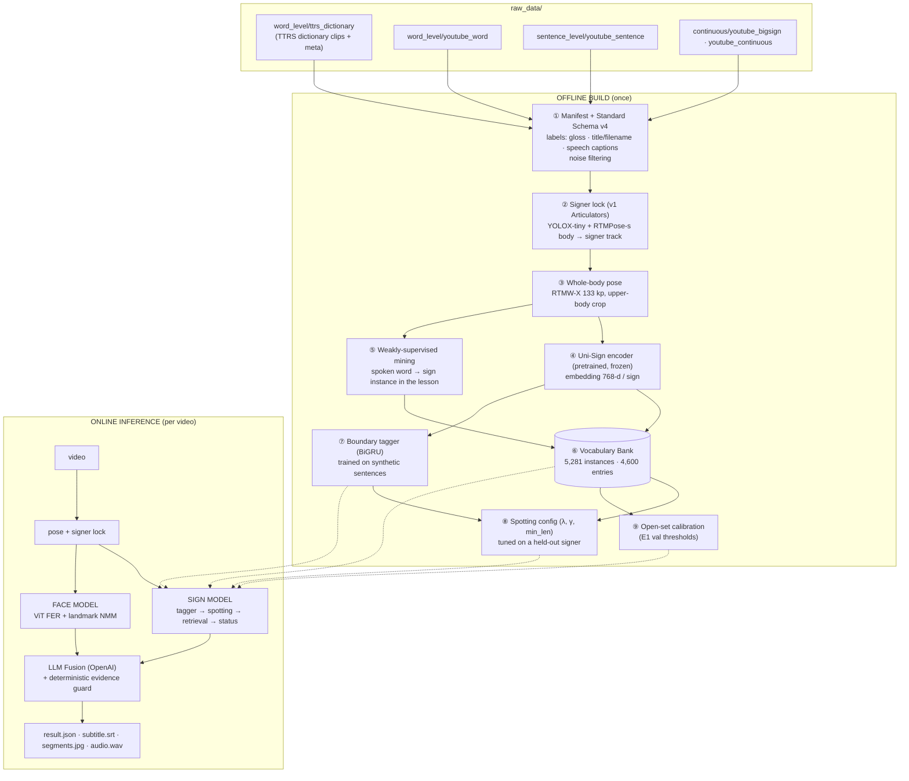
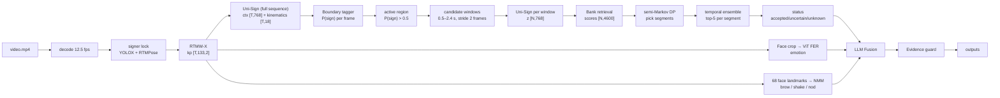

# ThaiSLM v4 (final) — Architecture

This document shows the path from `raw_data/` through the offline build to real-video inference. The configuration is the one used in the last run: `reports/v4_infer_final.json` and `notebooks/v4/07`.

Main idea: **the model is not a sentence classifier.** It turns video into pose, embeds each short sign segment with a pretrained encoder (Uni-Sign), and **retrieves** the nearest word from a vocabulary bank. When evidence is insufficient it outputs `[?] ≈ nearest word` instead of guessing.

Glossary of short labels used below:
- **E1:** new-signer vs full-dictionary retrieval evaluation.
- **OOV:** out of vocabulary.
- **NMM:** non-manual markers (brow, head, mouth).

---

## 1. Big picture



---

## 2. Offline build — step by step

### ① Raw data → manifest + Standard Schema v4
`modules/lexicon.py::build_schema_v4` · `scripts/v4.py schema`

```
raw_data/word_level/ttrs_dictionary/*.mp4 + meta   ──► label = TTRS gloss (lemma, category, pos, synonyms, signer)
raw_data/word_level/youtube_word/*.mp4 + info.json ──► label = parsed from title ("…/หมวดกิริยาอาการ/ขับรถยนต์" → ขับรถยนต์)
raw_data/sentence_level/youtube_sentence/*          ──► label = spoken words: th-orig VTT captions (word timestamps)
raw_data/continuous/*                               ──► excluded (broadcast/song: caption ≠ signing, lag, 2 people)
                                   │
                                   ▼
artifacts/manifests_v4/clips_v4.parquet      clip_id · source · subset · media_path · signer_id · title · label
                                             label_source(gloss|title) · usable_for(vocab|weak_word|"") · exclude_reason
artifacts/manifests_v4/speech_words.parquet  clip_id · word · t0 · t1 · source      (7,468 hits, 819 dictionary words)
artifacts/manifests_v4/cleaning_report.json  171 clips dropped with a reason (no label 77, broadcast/song 47, fingerspelling 40, TTRS >15 s 6, test entry 1)
```

### ② Signer lock (from v1) → `artifacts/tracks/*.npz`
`modules/articulators.py`

```
frames @12.5 fps ──► YOLOX-tiny person detection (every N frames)
                 ──► RTMPose-s body 17 kp
                 ──► signer lock (wrist confidence + size + layout zone, hysteresis) → body keypoints of the signer
```

### ③ Whole-body pose → `artifacts/pose_v4/<clip>.npz` (5,202 files)
`modules/wholebody.py` · `scripts/v4.py pose --set ttrs|youtube_labelled` · `pose_test`

```
signer body kp ──► upper_body_box (expanded so the hands get more pixels)
               ──► affine crop 256×192 ──► RTMW-X (rtmw-dw-x-l, ONNX Runtime CUDA, batch 48) ──► SimCC decode
npz: kp [T,133,2] (0..1)  sc [T,133]  fps  hw  t0
     133 = body 17 · feet 6 · face 68 · left hand 21 · right hand 21
```

### ④ Encoder: Uni-Sign pose encoder (pretrained, **frozen / zero-shot**)
`modules/unisign.py` · checkpoint `wlasl_pose_only_islr.pth` (Uni-Sign, ICLR 2025)

```
kp [T,133,2], sc [T,133]
  │ upsample ×2 (12.5 → 25 fps, the rate Uni-Sign was trained on)
  │ prepare_parts (official load_part_kp):
  │     body [2T, 9,3]   left [2T,21,3] (relative to wrist)   right [2T,21,3]   face [2T,18,3]
  ▼
per part:  Linear(3→64) → spatial ST-GCN chain → temporal ST-GCN chain   (left shares weights with right)
concat 4 parts (256×4) → Linear(1024→768)                                   = "gcn" features [B,2T,768]
  ▼
[prefix embedding: "Translate sign language video to English: "] ‖ gcn  →  mT5-base encoder (12 layers)
  ▼
"ctx" hidden states at frame positions [B,2T,768]  → mean over valid frames → L2-norm  →  z ∈ R^768 (one sign)
```

Selected by a pilot on a 932-sign gallery: **WLASL ctx** R@1 0.23 / R@5 0.50. Ruled out:
- CSL checkpoint.
- ST-GCN-only features.
- The v1 DINOv2 RGB model (R@1 0.00).

### ⑤ Weakly-supervised mining (label = speech in the clip, no manual labels)
`modules/mining.py` · `scripts/v4_build.py mine --rank_k 3`

```
speech word w at time t  (from speech_words.parquet)
  ──► candidate windows in [t−1.5 s, t+3.0 s] where the hands are raised
  ──► embed each window (④) and compare with the TTRS bank
  ──► accept only if w is ranked top-3 among all ~4.6k words      →  221 instances / 127 words / 56 videos
```

### ⑥ Vocabulary Bank → `artifacts/v4/bank.npz`
`scripts/v4_build.py embed_ttrs · embed_titles · bank`

```
┌────────────────────────── instance-level bank ──────────────────────────┐
│  Z [5281, 768]  words  source{ttrs 5036 · title 24 · mined 221}  signer │
│  4,600 entries: word 2,753 · compound 1,155 · phrase 655 · sentence 37  │
│  412 entries have ≥ 2 signers                                           │
└─────────────────────────────────────────────────────────────────────────┘
score(query, entry) = mean of the top-2 cosine similarities among that entry's instances
```

The full list is in `vocab/corpus/vocab.json`; sentences and phrases are in `vocab/corpus/sentence.json`.

### ⑦ Boundary tagger (a segmentation helper) → `artifacts/v4/segmenter.pt`
`modules/segment.py` · `scripts/v4_build.py seg_train`

```
training data: synthetic sentences = 2–7 TTRS signs of the same signer
               speed ×1–2.5 · interpolated transitions · pauses · signing-space compression · one-hand dropout
input  per frame: [ctx 768 ‖ kinematics 18]  (hand position/height/speed/angle/distance to face/confidence …)
model: LayerNorm → Linear(786→192) → BiGRU ×2 → Linear → {outside, begin, inside}
held-out signer: boundary F1 0.716
```

### ⑧ Spotting config → `artifacts/v4/spotting.json`
`scripts/v4_build.py spot_eval`

```
data: synthetic sentences of held-out signer S_ttrs_00 · bank with ALL of that signer's clips removed (78% OOV)
grid search on 120 "tune" sentences → report on 120 "test" sentences
selected: λ = 9 · γ = 1.0 · min_len = 14 frames · windows 6–30 frames · stride 2 · candidate aggregation = sum
test: segment F1 0.93 · 5.1 predicted vs 4.8 true words per sentence
```

### ⑨ Open-set calibration → `artifacts/v4/calibration.json`
Quantiles of correct matches on E1 val (new signer): `accepted`: score ≥ 0.638 and margin ≥ 0.071 · `uncertain`: score ≥ 0.564 · otherwise `unknown`.

> Tried and **not used** in final: metric adapter fine-tuning (worse on test; `config.json use_adapter=false`) · Whisper ASR labelling (not finished) · test-time augmentation consensus / DTW re-scoring (no gain).

---

## 3. Online inference — `modules/pipeline_v4.py::SignPipelineV4.run(video)`



### 3.1 Sign Model (detailed)

```
kp [T,133,2], sc [T,133]
│
├─(a) Tagger ─ sequence_features → Segmenter → prob [T,3] → act[t] = smooth(P_begin+P_inside) > 0.5
│      (on real video the tagger sees one long signing run with no internal boundaries → it only defines the active region)
│
├─(b) Candidate windows  W = {[a,b) : a on a 2-frame grid, 6 ≤ b−a ≤ 30, ≥ 60% of frames active}      (~500–800 per 7 s)
│
├─(c) Retrieval per window: upsample → parts (body scale from the whole video) → Uni-Sign ctx → z
│      S[w, entry] = mean top-2 cos(z_w, bank instances of entry)
│      z-score(w) = (top1 − mean_vocab) / std_vocab        ← how much the best word stands out from the whole vocabulary
│
├─(d) Semi-Markov DP (spotting)
│      maximise  Σ_picked (z-score(w) − λ)  −  γ · (active frames not covered)
│      subject to non-overlapping windows, length ≥ min_len (14 frames ≈ 1.1 s)
│      merge adjacent picks with the same best word
│
├─(e) Temporal ensemble per segment: candidates = Σ top-5 scores of every window inside the segment (±2 frames)
│
└─(f) Open-set status (per segment)
       accepted  : score ≥ 0.638 and margin ≥ 0.071 and ensemble top-1 == best-window top-1   → "word"
       uncertain : score ≥ 0.564                                                            → "word?"
       unknown   : otherwise                                                               → "[?] ≈ nearest"
```

Per-segment output:
`{f0, f1, t0, t1, status, nearest, score, margin, z, candidates:[{word, score, support}×5], window_top1}`

### 3.2 Face Model (separate from the Sign Model)

```
face box from face kp ──► ViT FER (trpakov/vit-face-expression), every 2nd frame, 224 px
                          → emotion, probs (7 classes), strongest non-neutral, intensity
68 face landmarks + head kp (relative to the signer's own baseline)
                          → brow_raise_tail (question?) · head_shake_cycles (negation) · head_nod_cycles · mouth_open · per-segment brow/mouth
```

### 3.3 Fusion + evidence guard (`modules/translate.py`)

```
payload = { segments: [t0,t1,status,nearest,top-5], face: {emotion, probs, nmm} }
   │
   ▼  OpenAI (OPENAI_MODEL = gpt-4.1-mini, temperature 0, JSON mode), system rules:
   │     use only each segment's candidates · unknown → [?] · uncertain only if the meaning is coherent
   │     add ไหม/ไม่ from the face · no evidence → sentence_th = "" and confidence ≤ 0.3
   ▼
guard_violations : any chosen word not in that segment's candidates (0 so far)
evidence_gloss   : what the Sign model alone supports, e.g. "เพื่อน? | จมูกแบน? | [?]≈ไม่พอ | สะโพก"
EVIDENCE GUARD (deterministic code, does not trust the LLM):
   show sentence_th only if (≥ 1 accepted sign) AND (≥ half of the segments resolved)
   otherwise → sentence_th = "" · tentative_sentence_th = LLM text · meaning_th = "ตรวจพบท่ามือ N ช่วง … ช่วง i ≈ word"
```

### 3.4 Outputs (`result_reporting/inference_v4/<video>/`)

| file | content |
|---|---|
| `result.json` | segments + face + fusion + timings |
| `subtitle.srt` | one line per segment: `word` / `word?` / `[?] ≈ word` |
| `segments.jpg` | 3 frames per segment + status + top-3 |
| `segment_prob.npy` | tagger probabilities |
| `audio.wav` | MMS-TTS Thai (`facebook/mms-tts-tha`), only when a sentence passes the guard |

---

## 4. Components: pretrained, trained, or rule-based?

| component | type | source |
|---|---|---|
| YOLOX-tiny, RTMPose-s (signer lock) | pretrained, frozen | rtmlib |
| RTMW-X 133 kp | pretrained, frozen | rtmlib / MMPose |
| Uni-Sign ST-GCN + mT5-base | pretrained, **frozen** (zero-shot) | Uni-Sign WLASL ISLR checkpoint |
| Vocabulary bank | **built** from data (no gradient training) | TTRS + YouTube titles + speech mining |
| Boundary tagger (BiGRU) | **trained** (synthetic sentences) | this project |
| Spotting DP parameters, calibration thresholds | **tuned** on a held-out signer / E1 val | this project |
| ViT FER | pretrained, frozen | trpakov/vit-face-expression |
| NMM cues | rules on landmarks | this project |
| LLM fusion | API (gpt-4.1-mini) + prompt rules | OpenAI |
| Evidence guard | deterministic rules | this project |
| TTS | pretrained | facebook/mms-tts-tha |

---

## 5. Where time goes (data_test, GPU)

| stage | video 1 (9.6 s) | video 2 (6.6 s) |
|---|---|---|
| pose (signer lock + RTMW-X) | 3.5 s | 1.9 s |
| tagger | 0.45 s | 0.15 s |
| spotting + retrieval | 4.2 s | 3.1 s |
| face | 0.5 s | 0.2 s |
| LLM | 3.8 s | 1.8 s |

---

## 6. Commands (build order)

```bash
conda activate hugging
python scripts/v4.py schema                      # ① manifest + schema
python scripts/v4.py pose --set ttrs             # ②③ (uses v1 signer tracks)
python scripts/v4.py pose --set youtube_labelled
python scripts/v4_build.py embed_ttrs            # ④
python scripts/v4_build.py embed_titles
python scripts/v4_build.py mine --rank_k 3       # ⑤
python scripts/v4_build.py bank                  # ⑥
python scripts/v4_build.py eval
python scripts/v4_build.py calib                 # ⑨
python scripts/v4_build.py seg_train             # ⑦
python scripts/v4_build.py spot_eval             # ⑧
python scripts/v4_build.py infer --tag final --tts   # inference on data_test/
python scripts/export_vocab.py                   # vocab/corpus/vocab.json, sentence.json
```
