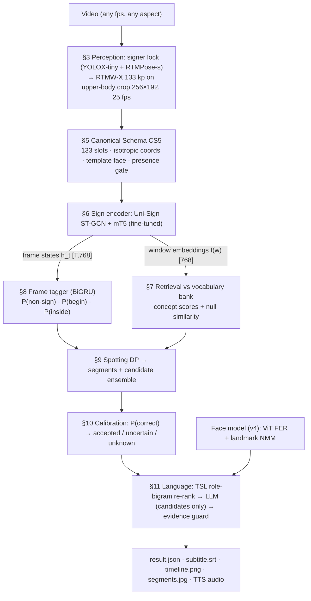
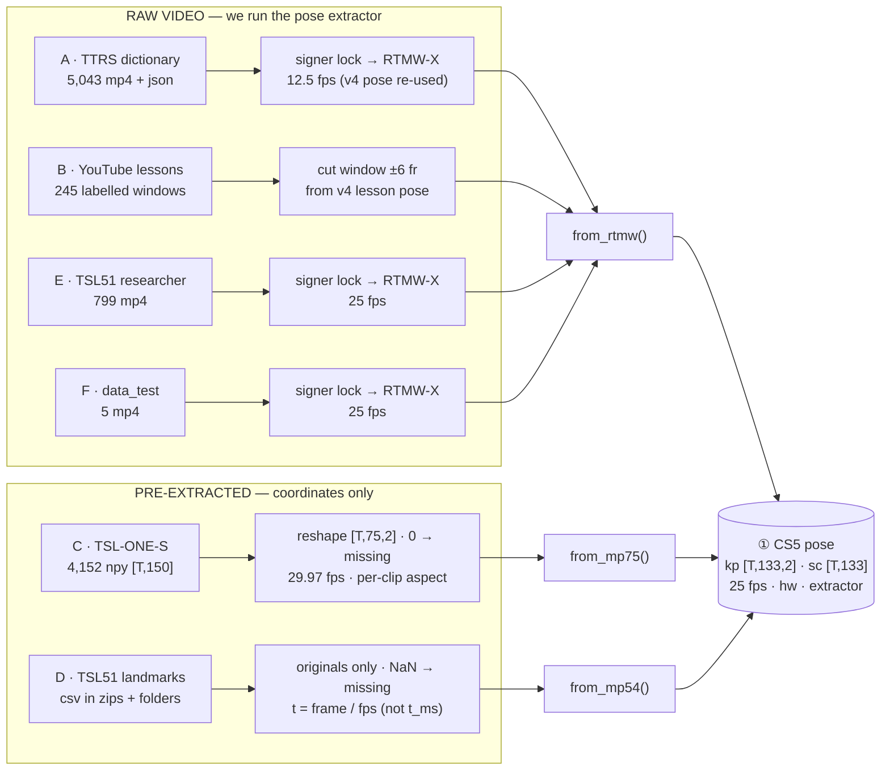
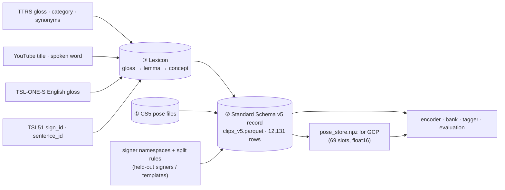
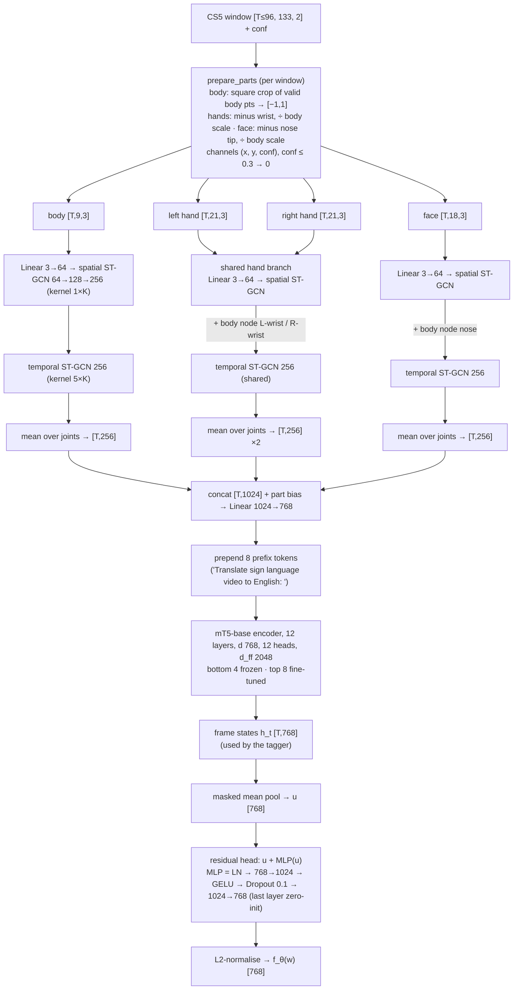
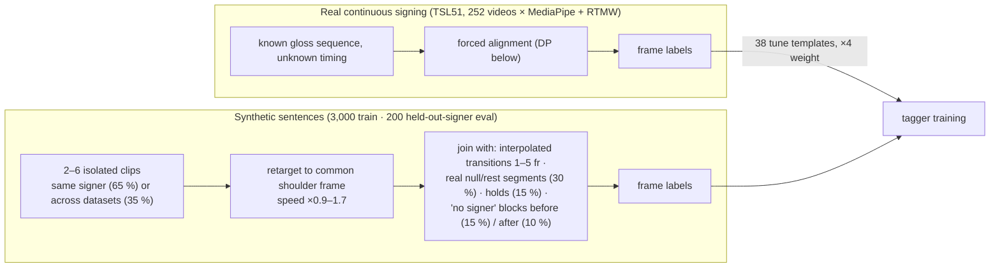
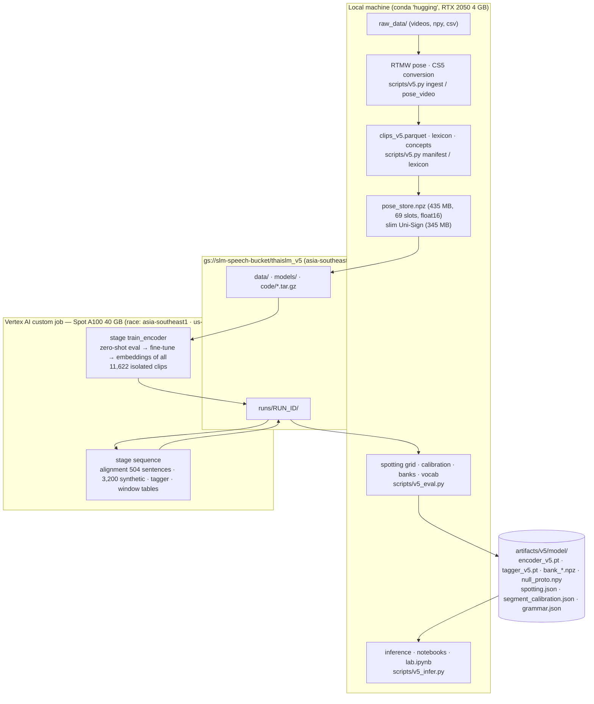

# ThaiSLM v5 — Technical Architecture

**Pose-based, retrieval-driven Thai Sign Language recognition and translation for continuous real-world video**

*Companion to `result_reporting/result_v5.md` (results, evaluation, costs). This document describes **what the system is**: every stage,
its inputs and outputs, tensor shapes, the technique used, the exact hyper-parameters of the deployed model, and where each piece lives in
the code. Section 4 shows how every data source (raw video or pre-extracted features) enters the standard; Section 13 explains the key ideas for readers new to the project.*

---

## Abstract

ThaiSLM v5 converts an RGB video of a signer into (i) time-stamped sign segments, each with a calibrated status and the nearest known Thai
concept, and (ii) an evidence-guarded Thai sentence with optional speech. The system is **not a sentence classifier**. It (1) extracts
whole-body 2-D keypoints with RTMW-X, (2) maps any pose source into a Canonical Schema (CS5), (3) encodes short temporal windows with a
Uni-Sign pose encoder (part-wise ST-GCN + mT5 encoder) fine-tuned on 98 signers with a concept-level metric objective and an explicit
*null* (non-sign) class, (4) detects signing frames with a BiGRU tagger, (5) spots words by a semi-Markov dynamic program over window-level
retrieval scores against a vocabulary bank of 12,843 instances / 4,570 concepts, (6) calibrates each spotted word with a logistic
P(correct) model, and (7) composes a sentence with a Thai-Sign-Language word-order prior and an LLM that is restricted to the visual
candidates. Training runs on Vertex AI (Spot A100); inference runs on a local 4 GB GPU.

---

## 1. System overview



| stage | input | output | technique | trained on | code |
|---|---|---|---|---|---|
| Perception | video frames | kp `[T,133,2]`, score `[T,133]` | YOLOX + RTMPose-s signer lock, RTMW-X (ONNX, CUDA) | pretrained (COCO-WholeBody cocktail14) | `modules/wholebody.py`, `articulators.py` |
| CS5 | any pose source | kp `[T,133,2]` (x/W, y/H), conf `[T,133]`, 25 fps | slot mapping, Procrustes face template, resampling, gap filling | face template fitted on 40k TTRS frames | `modules/schema_v5.py` |
| Encoder | CS5 window `≤96` frames | frame states `[T,768]`, embedding `[768]` (unit norm) | part-wise ST-GCN → mT5-base encoder → mean pool → residual MLP | 8,706 clips, 98 signers, 4,529 concepts | `modules/encoder_v5.py`, `modules/unisign.py` |
| Retrieval | window embedding | concept scores `[4,571]`, null similarity | mean of top-2 instance cosines per concept | bank (no training) | `encoder_v5.concept_scores` |
| Tagger | frame states + 13 kinematics | `[T,3]` probabilities | 2-layer BiGRU | 3,000 synthetic + 252 aligned real sentences | `modules/sequence_v5.py` |
| Spotting | window table + tagger probs | segments `(f0, f1, candidates)` | semi-Markov DP with null competitor, temporal ensemble | 4 hyper-parameters grid-searched on tune sets | `modules/decode_v5.py` |
| Calibration | 8 segment features | P(correct), status | logistic regression | real continuous tune sentences | `decode_v5.LogReg` |
| Language | statuses + candidates + face | chosen words, Thai sentence | role-bigram LM re-rank, GPT (JSON), deterministic guard | 62 TSL51 sentences | `modules/grammar_v5.py`, `translate_v5.py` |
| Speech | Thai text | waveform | MMS-TTS Thai (VITS) | pretrained | `modules/tts.py` |

---

## 2. Notation

| symbol | meaning |
|---|---|
| `T` | number of frames at 25 fps |
| `kp[t, j] ∈ R²` | keypoint `j` of frame `t`, normalised `(x/W, y/H)` |
| `c[t, j] ∈ [0,1]` | keypoint confidence (0 = missing) |
| `iso(kp) = (x·W/H, y)` | isotropic coordinates in units of frame height |
| `w = [a, b)` | a temporal window (frames `a … b−1`), length `L = b − a` |
| `f_θ(w) ∈ R^768`, `‖f‖ = 1` | window embedding of the fine-tuned encoder |
| `B = {(z_i, k_i)}` | vocabulary bank: instance embeddings `z_i` with concept id `k_i` |
| `s_k(w)` | concept score of concept `k` for window `w` |
| `n(w)` | cosine similarity of `f_θ(w)` to the null prototype |
| `p_t = (p⁰, p¹, p²)` | tagger probabilities non-sign / begin / inside |

---

## 3. Perception: video → whole-body keypoints

```
frame (BGR, 25 fps) ──► signer lock: YOLOX-tiny person boxes + RTMPose-s body (17 kp) ──► track the main signer
                    ──► upper-body box: centre = shoulder mid-point, half-width 1.35·SW, top = head − 0.9·SW,
                        bottom = shoulders + 1.8·SW (SW = shoulder width), widened to include both wrists
                    ──► affine crop 256×192 ──► RTMW-X (dw-x-l, SimCC head) ──► 133 kp + score, batched 48 crops / call
```

- **Keypoint layout (COCO-WholeBody):** body 0–16, feet 17–22, face 23–90 (iBUG-68), left hand 91–111, right hand 112–132. "Left" = the signer's left.
- **Why an upper-body crop:** the hands get about 2× more pixels than with a full-person box, which is decisive for handshape.
- **Presence gate (v5):** a signer is present in frame `t` iff `mean(c[t, {nose, L-shoulder, R-shoulder}]) > 0.5`. Real signer frames have p1 = 0.93; title cards / black frames give RTMW scores ≤ 0.32. Frames without a signer are **blanked** (`kp = 0`, `c = 0`) exactly like the "no signer" blocks the tagger was trained on, and their tagger output is forced to non-sign.

---

## 4. Data sources and ingestion gates

The corpus comes from six different "gates". Some deliver **raw video** (we run pose extraction ourselves), some deliver **pre-extracted
features** (someone else ran MediaPipe and we only get coordinates). Each gate has its own reader, label source, time axis and quality checks,
but **every gate ends in the same three standards**:

1. **CS5 pose file** — one `.npz` per clip in one keypoint layout, one frame rate, one coordinate convention (§5).
2. **Standard Schema v5 record** — one row per clip in `artifacts/v5/clips_v5.parquet`: identity, signer, labels, split role, span.
3. **Concept label** — the source gloss resolved to a Thai lemma and a concept id through the lexicon (§7).

Nothing downstream (encoder, bank, tagger, evaluation) reads a raw source again; it only reads these standards.

### 4.1 Gate map

**(a) From each gate to the pose standard ①.** One row per gate: what arrives → how it is read → which converter produces CS5.



**(b) How the three standards are joined.**



### 4.2 Gate summary

| gate | source type | files in | reader | extractor | native fps / time axis | label source | clips out |
|---|---|---|---|---|---|---|---|
| **A** TTRS dictionary | raw video (mp4 + json) | 5,043 | OpenCV decode (timestamp-resampled) | RTMW-X, upper-body crop | 12.5 fps decode | TTRS gloss, category, POS, synonyms, signer | 5,036 |
| **B** YouTube lessons | raw video (from v4) | 245 windows | v4 lesson pose, window cut | RTMW-X | 12.5 fps | title (24) / caption word verified by pose (221) | 245 |
| **C** TSL-ONE-S | pre-extracted `.npy` | 4,152 | `np.load` | MediaPipe Holistic (by the authors) | 29.97 fps, one row per frame | `tsl_one_s_dataset.json` (English gloss, official split, region) | 4,148 |
| **D** TSL51 landmarks | pre-extracted csv (zips + folders) | 1,155 expert originals + 547 + 252 | pandas, zip streamed | MediaPipe Holistic (by the authors) | metadata `fps_extracted` (25/30/50), one row per frame | `sign_id`, `sentence_id` in metadata | 1,099 + 547 + 252 |
| **E** TSL51 researcher videos | raw video | 799 mp4 | OpenCV decode | RTMW-X, upper-body crop | 25 fps decode | same metadata as D (paired by `video_id`) | 547 + 252 |
| **F** data_test | raw video | 5 mp4 | OpenCV decode | RTMW-X, upper-body crop | 25 fps decode | none (reference glosses only for scoring) | 5 |

### 4.3 Raw-video gates (A, B, E, F)

All raw video goes through the same perception stack (§3) so that the extractor is identical to inference.

```
mp4 ──► decode at target fps (OpenCV, frames picked by timestamp, not by index)
    ──► signer lock: YOLOX-tiny persons + RTMPose-s body → keep the main signer's track
    ──► upper-body box per frame (shoulders, head, reachable hand space) → affine crop 256×192
    ──► RTMW-X batched on GPU (CPU workers decode + warp crops) → kp [T,133,2] (x/W, y/H), score [T,133]
    ──► raw pose .npz (kept: the face model needs the real RTMW face points)
    ──► from_rtmw(): template face, confidence clip, gap fill, resample → CS5 .npz
```

| gate | specifics |
|---|---|
| **A · TTRS** | Pose was extracted once in v4 (`artifacts/pose_v4`, 12.5 fps) and is **re-used, not re-extracted**; CS5 resamples it to 25 fps. v4 cleaning is inherited: clips > 15 s (multi-sign explanations) removed, clips with mean hand score < 0.3 or no active span removed. The TTRS label keeps school annotations and variants, which the lexicon later splits off. Signer = TTRS creator name → `S_ttrs_NN`. |
| **B · YouTube** | Only v4's labelled windows are used: 24 lesson clips whose title names the sign, and 221 speech-mined instances (a caption word at time t is accepted only if the pose encoder ranks that word top-3 in a window near t). The window `[f0, f1]` ± 6 frames is cut from the lesson's v4 pose. One video ≈ one signer (`S_yt_<video>`). Broadcasts, songs and fingerspelling drills were excluded in v4. |
| **E · TSL51 videos** | Extracted fresh at 25 fps so that the researcher's clips exist **twice**: MediaPipe (gate D) and RTMW (gate E), linked by `pair_id`. This pairing measures the extractor gap and lets the deploy bank contain RTMW versions of TSL51 words. |
| **F · data_test** | Same path as E; stored under `pose/test` + `pose/test_raw`; role `data_test`; never enters the bank, training or tuning. The presence gate (§3) handles title cards at inference time. |

### 4.4 Pre-extracted feature gates (C, D)

These sources skip perception. The risks are different: **unknown or wrong metadata** (frame size, time axis), **different topology**, and
**missing values encoded differently**. Each gate therefore has an explicit decoder plus checks.

**Gate C · TSL-ONE-S (`.npy`)**

```
SS_CC_GGGG.npy  (SS signer, CC category, GGGG gloss code)  →  float64 [T, 150]
  ├─ reshape [T, 75, 2] ; layout verified on the data:
  │    0–32  MediaPipe pose (nose 0, eyes 2/5, ears 7/8, mouth 9/10, shoulders 11/12, elbows 13/14, wrists 15/16, …)
  │    33–53 left hand (root lies at pose wrist 15 in 100 % of frames) ; 54–74 right hand (root at wrist 16)
  ├─ (0, 0) → missing (conf 0) ; present → conf 1 ; a hand is present only if all 21 points are
  ├─ time: t = i / 29.97 (recording standard in the paper; mean clip 1.94 s × 29.97 ≈ 58 rows = observed median)
  ├─ frame aspect: NOT the published 1280×720 → estimated per clip from body geometry (formula in §5.3 b)
  ├─ labels: join video_id with tsl_one_s_dataset.json → English gloss, official split, region
  │    4 annotation ids have no .npy and 4 .npy have no annotation → 4,148 labelled clips
  ├─ split: official split mixes every signer into train/val/test → re-split by signer
  │    test signers 02, 08, 13, 17, 23 · val 06, 11, 19 · train the other 21
  └─ from_mp75() → CS5
```

**Gate D · TSL51 (`.csv`, partly inside zips)**

```
metadata/expert_metadata.csv (45,125 rows)  user_sign_metadata.csv (547)  sentence_metadata.csv (252)
  ├─ experts: keep is_augmented = FALSE → 1,155 originals (1,033 interpreter + 122 web-scraped)
  │    the 44k augmented copies are not used (augmentation is done on the fly, in pose space, §6.2)
  │    csv read directly from expert_primary_02/03.zip and expert_scraped.zip (matched by file name, no unzip)
  │    web-scraped rows with source = ttrs are copies of our TTRS videos → dropped (55) ; 1 empty csv → dropped
  ├─ columns: frame, t_ms, lh_{x,y,z}0–20, rh_*, {l,r}_{shoulder,elbow,wrist}_{x,y,z,vis,pres}, 4 brow points, 2 mouth corners
  │    NaN → missing ; arm points also missing if vis ≤ 0.3
  ├─ time: t = frame / fps_extracted     (t_ms is the extraction loop's clock — see §5.3 f)
  ├─ frame size: width/height_extracted from metadata (checked anatomically: consistent)
  ├─ brows are named by image side: "lbrow_*" (mesh 105/70) is the signer's RIGHT brow
  ├─ labels: sign_id "ฉัน_var_2" → lemma ฉัน + variant var_2 ; "null_act" → <null> ;
  │    sentence_id "กรุงเทพ_var_1__ฉัน_var_1__…" → ordered gloss sequence
  ├─ signer: expert_01 / expert_02 · web clip → its own signer · researcher → S_51_user (held-out test signer)
  └─ from_mp54() → CS5 (nose / eyes / ears imputed from the face template, flagged)
```

### 4.5 Standard ② — Standard Schema v5 record (`clips_v5.parquet`)

| column | type | meaning | example |
|---|---|---|---|
| `clip_id` | str | globally unique, **prefixed by gate** | `ttrs:5d09…`, `tslone:11_07_0238`, `t51x:vid_1313_original`, `t51u:` / `t51ur:` (researcher sign MP / RTMW), `t51s:` / `t51sr:` (sentence MP / RTMW), `yttitle:`, `ytmined:`, `test:test1` |
| `dataset`, `subset` | str | source family and sub-collection | `tslone` / `cat07`, `tsl51` / `tsl51_user_sign_rtmw` |
| `kind` | enum | `isolated` · `null` · `sentence` · `test` | |
| `pose_path` | str | CS5 file | `artifacts/v5/pose/tslone/11_07_0238.npz` |
| `extractor` | enum | `rtmw` · `mp75` · `mp54` | |
| `signer` | str | **namespaced** signer id (no collisions across datasets) | `S_ttrs_01`, `S_one_11`, `S_51_expert_01`, `S_51_scraped_thsl_vid_1313`, `S_51_user`, `S_yt_<video>` |
| `gloss` | str | label exactly as the source gives it | `Yor Yuk`, `ฉัน_var_2`, `ติ่งหู` |
| `lemma`, `concept` | str | Thai lemma and concept after the lexicon (for sentences: the ordered gloss sequence) | `ย`, `กิน` |
| `sign_variant` | str | school / variant tag split off the gloss | `var_2`, `ภาษามือวิทยาลัยราชสุดา` |
| `role` | enum | `train` · `val` · `test` · `tagger_train` · `sentence_test` · `deploy` · `data_test` | |
| `n_frames` | int | length at 25 fps | |
| `span_f0`, `span_f1` | int | signing span inside an isolated clip (hand raise / motion, ±2 frames) | |
| `hand_frac` | float | share of frames with a detected hand | |
| `category`, `official_split`, `region` | — | TSL-ONE-S metadata | |
| `recording_variation`, `pair_id` | — | TSL51 (`no_space`/`with_space`, `statue`/`fidgeter`/`transition`), MP↔RTMW pairing | |

For GCP the records and poses are packed once into `pose_store.npz` (only the 69 used slots, float16, concatenated with an offset index,
435 MB) + `clips_v5.parquet` + `concepts.json`.

### 4.6 Quality gates (checks run before anything is trained)

| check | how | result |
|---|---|---|
| handedness / mirroring | distance hand root ↔ body wrist, x(left shoulder) > x(right shoulder) | consistent in all gates; no flip |
| time axis | MP (gate D) vs RTMW (gate E) length of the same video | identical after the fix (41,039 vs 41,045 frames) |
| frame size | shoulder width / mouth drop per source (reference 2.4 from sources with known frame) | TSL-ONE-S corrected per clip; TSL51 metadata confirmed |
| scale after conversion | hand length / shoulder width per source | 0.22–0.30 for all sources |
| duplicates | source = ttrs inside TSL51 web-scraped | 55 dropped |
| label join | annotation ↔ file | TSL-ONE-S: 4 + 4 orphans dropped |
| empty / unreadable | row count < 2 | 1 TSL51 csv dropped |
| leakage | data_test sha256 block-list (v4) · test signers never in train · data_test never in manifest roles used for building | enforced |

Report: `artifacts/reports/v5_schema_audit.json`, `v5_manifest_summary.json`; figure `result_reporting/v5_schema_sources.png`.

### 4.7 Notes for readers (ทำไมต้องแยก "ประตู")

- **Raw video vs pre-extracted features are not equal inputs.** With raw video we control the extractor, the frame rate and the crop, so the data looks exactly like what inference will see. With pre-extracted features we inherit someone else's choices (MediaPipe instead of RTMW, their frame size, their timestamp column), and those choices are usually undocumented — two of them were wrong here (TSL51 time, TSL-ONE-S frame size). A gate makes those assumptions explicit, testable and fixable in one place.
- **Why not re-extract everything with RTMW?** TSL-ONE-S and TSL51 experts are released without videos, so their MediaPipe coordinates are the only form available. CS5 therefore converts *towards a common representation* instead of assuming one extractor.
- **Why keep the original gloss next to the concept?** Mapping decisions (e.g. Grandpa → ตา) can be revised later without touching the pose files; the manifest is rebuilt from the untouched source labels.
- **Adding a new dataset** means writing one new gate: a reader, a time axis, a label join, a `from_*` converter to CS5, and the quality checks above. Everything after the gate works unchanged.

---

## 5. Canonical Schema v5 (CS5)

### 5.1 Why a canonical schema

Training data arrives in three incompatible forms; inference always uses RTMW. If the formats were fed raw, the network could separate
datasets (and extractors) instead of signs.

| source | native form | extractor | fps | missing |
|---|---|---|---|---|
| TTRS dictionary, YouTube (v4), TSL51 researcher (ours), data_test | 133 kp + score | RTMW-X | 12.5 / 25 | — |
| TSL-ONE-S `.npy` | 75 kp (pose 33 + hands 21+21), x/y only, zeros = missing | MediaPipe Holistic | 29.97 | jaw, inner mouth, brows, scores, frame size |
| TSL51 `.csv` | 54 kp (6 arm + 4 brow + 2 mouth + hands), x/y/z, NaN = missing | MediaPipe Holistic | 25–50 | nose, eyes, ears, jaw, inner mouth |

### 5.2 Slots actually used (69 of 133)

The Uni-Sign encoder reads four body parts. CS5 stores all 133 slots but only these are filled:

| part | slots | points | root used for normalisation |
|---|---|---|---|
| body | `[0, 3, 4, 5, 6, 7, 8, 9, 10]` = nose, L/R ear, L/R shoulder, L/R elbow, L/R wrist | 9 | body bounding square |
| left hand | 91–111 | 21 | wrist (91) |
| right hand | 112–132 | 21 | wrist (112) |
| face | jaw `23,25,…,39` (9) + inner mouth `83–90` (8) + nose tip `53` | 18 | nose tip (53) |

MediaPipe hand-21 and COCO-WholeBody hand-21 have the same joint order (wrist, thumb 1–4, index 5–8, middle 9–12, ring 13–16, pinky 17–20).
Handedness was verified per source: the left hand root lies next to the left body wrist in 100 % of sampled frames. No mirroring is applied.

### 5.3 Conversion steps (per clip)

```
source array ──► (a) slot mapping ──► (b) isotropic coordinates ──► (c) face harmonisation (+ head imputation for TSL51)
             ──► (d) confidence harmonisation ──► (e) hand-gap interpolation ──► (f) temporal resampling to 25 fps ──► CS5 .npz
```

**(a) Slot mapping.** TSL-ONE-S pose 0/2/5/7/8/11–16 → slots 0/1/2/3/4/5–10; mouth corners pose 9/10 → face slots 77/71; hands 33–53 → 91–111,
54–74 → 112–132. TSL51 `l_shoulder … r_wrist` → 5–10, `mouth_left/right` → 77/71, `lh_*`/`rh_*` → hands.

**(b) Isotropic coordinates.** All geometry (template fitting, augmentation, kinematics) is done on `iso(kp) = (x·W/H, y)` so that a 4:3,
16:9 or portrait (202×360) video keeps true hand shapes.
- *TSL-ONE-S frame size is not published and is not 1280×720.* Under 1280×720 the ratio `r = shoulder width / (shoulder-mid → mouth-mid drop)`
  is 4.6, whereas every source with a known frame gives ≈ 2.4. The aspect `W/H` is therefore estimated per clip:

```
r_clip   = median_t  |x_Lsh − x_Rsh| / |ȳ_sh − ȳ_mouth|        (computed at aspect 1)
r_signer = median over that signer's clips
r̂        = exp( 0.5·ln r_clip + 0.5·ln r_signer )            (shrinkage toward the signer)
W/H      = clip( 2.40 / r̂ , 0.45 , 1.9 )
```
  Check that was not used for fitting: hand length / shoulder width moved from 0.19 to 0.245, matching the other sources (0.22–0.30).

**(c) Face harmonisation.** A mean shape of 9 anchors (nose, eyes, ears, mouth corners, brow centres) + the 18 Uni-Sign face points is fitted once
by generalised Procrustes on 40,000 frontal TTRS frames (nose at origin, unit mouth width). For every frame of every source a similarity
transform is estimated from the anchors that source has:

```
anchors used:  RTMW, TSL-ONE-S → {nose, eye_L, eye_R, mouth_L, mouth_R}        TSL51 → {mouth_L, mouth_R, brow_L, brow_R}
(s, R, t) = argmin Σ_j ‖ s·R·A_j + t − a_j ‖²          (Umeyama, ≥ 2 anchors)
parameters (s, angle, t) interpolated over gaps and median-filtered over 5 frames
face slots  ← s·R·F_template + t            (all sources, RTMW included)
slots 83/87 ← observed mouth corners         (keeps real mouth width)
TSL51 only: nose, eyes, ears ← s·R·A_template + t   (flagged as imputed)
```
The face is template-based *for every source* so that face detail cannot reveal the dataset. Cost: mouthing is not modelled.

**(d) Confidence.** RTMW scores clipped to `[0, 1]`; MediaPipe detections = 1, missing = 0; face template = 1 while a face was seen within ±12 frames.

**(e) Hand gaps.** Whole-hand dropouts of ≤ 0.2 s with valid frames on both sides are linearly interpolated (MediaPipe loses hands often;
RTMW rarely), for every source alike.

**(f) Time.** Each source is resampled to 25 fps on its *own* time axis by linear interpolation; a point is valid only if both neighbours
are valid (or the nearest one is within ¼ frame).
- TTRS / YouTube: `t = i / 12.5`. TSL-ONE-S: `t = i / 29.97`.
- *TSL51:* `t = frame / fps_metadata`. The csv column `t_ms` is the extraction loop's wall-clock (a 13.0 s / 391-frame video spans 15.9 s; up to 3× on expert clips) and is ignored. After this fix, MediaPipe and RTMW versions of the same 799 videos have identical length.

Output per clip: `artifacts/v5/pose/<source>/<id>.npz` with `kp float16 [T,133,2]`, `sc float16 [T,133]`, `fps=25`, `hw=(H,W)`, `extractor`, `imputed`.

---

## 6. Sign encoder

### 6.1 Network



| component | parameters | trainable in v5 |
|---|---|---|
| part-wise ST-GCN (4 parts; hands share weights) + projection | 5.35 M | all |
| mT5-base encoder (token table removed; prefix kept as 8 fixed vectors) | 84.95 M | top 8 blocks + final LN = 56.64 M |
| residual embedding head | 1.58 M | all |
| CosFace proxies (4,571 concepts × 768) — training only | 3.51 M | all |

Initialisation: Uni-Sign **WLASL pose-only ISLR** checkpoint (pretrained on CSL-News 1,985 h, fine-tuned on WLASL-2000). Because the head's
last layer is zero-initialised, step 0 reproduces the zero-shot Uni-Sign embedding exactly.

### 6.2 Training data and sampling

- **Instances:** isolated clips with role `train` from TTRS (4,844), TSL-ONE-S (2,763, 21 signers) and TSL51 experts (1,099) — 98 signers, 4,529 concepts (§12). Each clip is cropped to its signing span (hand raise/motion detector, ±2 frames).
- **Batch = P·K + nulls = 48 concepts × 2 instances + 8 null windows.**
  - 65 % of the 48 concepts are drawn from the 379 concepts seen from ≥ 2 signers; the rest from all concepts.
  - The second instance is taken from a **different signer** (and therefore often a different dataset/extractor) with probability 0.85 when one exists; otherwise it is another view of the same clip.
- **Null windows** (class `<null>`):
  1. TSL51 `null_act` clips (standing, fidgeting, touching clothes, transitions);
  2. the rest frames before/after an isolated sign (≥ 8 frames);
  3. a *straddle*: last 30–50 % of sign A + 2–5 interpolated frames + first 30–50 % of sign B, with B retargeted onto A's shoulders.
  These teach the space what a window between words looks like, which is what spotting must reject.

**Augmentation** (applied in isotropic coordinates, per view):

| transform | range | models |
|---|---|---|
| speed (linear resampling) | ×0.75–1.35 (p = 0.8) | signing rate |
| start/end trimming | ±15 % of the span | imperfect segmentation |
| rotation / scale / shear / shift | ±10°, 0.9–1.1, ±0.08, ±0.05 | camera |
| Gaussian jitter | σ = 0.004 (p = 0.5) | RTMW noise |
| binarise confidence (> 0.3 → 1) | p = 0.5 | MediaPipe confidence |
| drop one hand for 6–15 frames | p = 0.3 | MediaPipe hand loss |
| length cap | uniform resample to ≤ 96 frames | memory |

### 6.3 Objective

```
L = L_CosFace + 0.5 · L_SupCon

L_CosFace = −log  exp(s·(cos(f_i, W_{y_i}) − m)) / [ exp(s·(cos(f_i, W_{y_i}) − m)) + Σ_{k≠y_i} exp(s·cos(f_i, W_k)) ]
            s = 30, m = 0.25; applied only to samples whose concept has ≥ 2 signers, or is <null>
            W initialised with zero-shot class means

L_SupCon  = mean_i  −(1/|P(i)|) Σ_{p∈P(i)} log  exp(f_i·f_p/τ) / Σ_{a≠i} exp(f_i·f_a/τ)          τ = 0.07
            P(i) = other samples of the same concept in the batch (incl. the augmented view)
```

Why the CosFace restriction: 4,150 of the 4,529 training concepts (almost all TTRS words) have a single signer; a proxy loss on them teaches instance memorisation (observed as falling
new-signer E1). They are still shaped by SupCon on augmented views.

### 6.4 Optimisation and selection

| item | value |
|---|---|
| optimiser | AdamW, weight decay 0.01, grad-clip 1.0, bf16 autocast |
| learning rates (OneCycle, cosine, 6 % warm-up) | ST-GCN 1e-4 · mT5 2e-5 · head and proxies 5e-4 |
| schedule | 4,000 steps planned, evaluation every 400 (this run was stopped by hand; `--patience 4` early stopping was added to the job code afterwards) |
| model selection | `0.5·MRR(TTRS new-signer val) + 0.5·MRR(TSL-ONE-S val signers, open vocabulary)` |
| selected checkpoint | **step 400** (later steps over-fit; run stopped at ~1,600) |
| hardware | Vertex AI Spot A100 40 GB, 10 CPU data workers, ~0.5 s/step |

### 6.5 Inference-time uses of the encoder

- **Window embedding** `f_θ(w)` — every spotting window is encoded independently (own body crop), exactly like a training clip.
- **Frame states** `h_t` for the tagger — long videos are processed in chunks of 400 frames with 50-frame overlap; overlapping states are averaged with triangular weights `min(i, L−i)` capped at 25.

---

## 7. Vocabulary bank and retrieval

```
bank B = {(z_i, k_i)}  z_i = f_θ(clip_i)   (float16, precomputed)
s_k(w) = mean of the two largest  z_i·f_θ(w)  over instances with k_i = k      (one instance → that cosine)
z(w)   = ( max_k s_k(w) − mean_k s_k(w) ) / std_k s_k(w)                        (how much the best concept stands out)
n(w)   = f_θ(w)·ν ,   ν = normalised mean embedding of all <null> training windows
```

| bank | instances | concepts | used for |
|---|---|---|---|
| `bank_eval.npz` | 8,672 | train signers only | all tuning and held-out evaluation |
| `bank_deploy.npz` | 12,843 | 4,570 | real use: every labelled clip of every source and both extractors, plus 1,301 word segments from TSL51 sentences whose forced-alignment score ≥ 0.648 (top 75 %) |

**Concepts.** A concept is a set of interchangeable Thai lemmas (e.g. กิน = ทาน = รับประทาน). Source glosses map to lemmas by rules (TTRS school
annotations, TSL51 `_var_k`, 42 Thai consonant names, vowels, numbers), GPT-4.1 with TTRS candidates (TSL-ONE-S English glosses), and a manual
review; synonym groups come from text-embedding neighbours verified by an LLM and a manual veto list (`modules/lexicon_v5.py`). The bank scores
concepts, so every sign variant of every member counts as evidence. **Adding a word = adding embeddings; no retraining.**

---

## 8. Continuous signing: frame tagger

### 8.1 Model

```
x_t = [ h_t (768)  ‖  k_t (13) ]                       T × 781
      k_t = body seen; per hand: seen, raise (shoulder widths above shoulder line), wrist speed/5,
            distance to nose/3, hand-shape change rate/5; max raise; max speed/5
x → LayerNorm → Linear 781→192 → GELU → Dropout 0.1 → BiGRU(192, 2 layers, dropout 0.1) → Linear 384→3 → softmax
p_t = (P non-sign, P begin, P inside)                  1.26 M parameters
```

### 8.2 Training data



**Forced alignment** (every gloss must be placed, in order; gaps are free):

```
windows W: lengths 8,12,…,48 frames, stride 2;  S[w, i] = s_{g_i}(w)  (concept score of the i-th gloss)
F[0,0] = 0
F[t,i] = max(  F[t−1, i]                                                   (gap frame)
            ,  max_{w=[a,t)}  F[a, i−1] + S[w, i] − 0.08·|ln(L/24)|  )     (gloss i ends at t)
segments = back-trace of F[T, n]
```

Labels: first frame of a segment = begin (1), rest of the segment = inside (2), all other frames = non-sign (0).
Loss: cross-entropy with class weights (1, 4, 1); AdamW 1e-3, OneCycle, batch 32, 20 epochs; selection = boundary-F1 + sign-frame-F1 on held-out-signer synthetic sentences.
Split: templates are split 50/50 — one half trains the tagger and tunes the decoder, the other half is never used before testing.

---

## 9. Spotting decoder (recognition-driven segmentation)

### 9.1 Candidate windows

```
signing frames    act_t = [ smooth₅(p¹_t + p²_t) > 0.5 ]  ∧  present_t
windows           w = [a, a+L),  L ∈ {8, 12, …, 48} (0.32–1.92 s),  a on a 2-frame grid,  mean(act[a:a+L]) ≥ 0.6,  L ≥ 20
per window        f_θ(w) → top-10 concepts, s_1(w) ≥ s_2(w) ≥ …, z(w), n(w)
```

### 9.2 Window gain and dynamic program

```
gain(w) = z(w) − λ − μ · max(0, n(w) − s_1(w))  +  β · max_{|d|≤2} p¹_{a+d}
            evidence   cost   looks more like rest/transition      boundary evidence
            of a word          than any word ("null competitor")    from the tagger

G[0] = 0
G[e] = max(  G[e−2] − γ · Σ_{t∈[e−2,e)} act_t            (leave active frames uncovered)
          ,  max_{w=[a,e)} G[a] + gain(w)  )             (place a word window ending at e)
```

Selected windows are non-overlapping. Two consecutive picks with the same top-1 concept and a gap ≤ 2 frames are merged.

### 9.3 Candidate ensemble per segment

```
for a segment [f0, f1):  W* = windows inside [f0−2, f1+2) with L ≥ 20
support_k = Σ_{w∈W*} s_k(w)·[k ∈ top-5(w)] / |W*| ,  best_k = max_{w∈W*} s_k(w)
candidates = top-5 concepts by support_k        nearest = candidates[0]
```

### 9.4 Deployed hyper-parameters

| symbol | value | meaning | how chosen |
|---|---|---|---|
| λ | 8.0 | minimum stand-out (z) for a word | grid on tune sets (v1–v4 grids, final bracketed) |
| μ | 5.0 | null-competitor weight | grid |
| β | 5.0 | begin-probability bonus | grid |
| γ | 0.5 | penalty per uncovered signing frame | grid |
| min_len | 20 frames (0.8 s) | shortest word window | grid; shorter lengths did not help even at 2× speed |
| act_thr / min_inside | 0.5 / 0.6 | signing-frame definition | fixed |
| tune sets | held-out-signer synthetic (100) + TSL51 tune templates: MediaPipe, RTMW, RTMW ×1.5, RTMW ×2 | | objective = spot-F1 + 0.5·seg-F1 − 0.05·count error |

---

## 10. Segment calibration (open-set status)

```
x = [ z, s_1, s_1 − s_2, n − s_1, mean p_sign over segment, [window top-1 = ensemble top-1], min(support ratio, 5), length/25 ]
P(correct) = σ( wᵀ·(x − μ_x)/σ_x + b )            logistic regression, L2 1e-2, fitted on real continuous tune sentences
status = accepted   if P ≥ 0.46   (≥ 80 % precision on tune)
         uncertain  if P ≥ 0.05
         unknown    otherwise  → displayed as "[?] ≈ nearest"
```

Largest weights: margin `s_1 − s_2` (+1.15), ensemble agreement (+0.58), score `s_1` (+0.53), tagger sign probability (+0.45).
Held-out precision of the accepted tier: 0.84 (MediaPipe), 0.76 (RTMW).

---

## 11. Language layer

### 11.1 TSL word-order prior

Every concept carries a grammatical role: SUBJ, OBJ, VERB, STATE, ADJ, GREET, TIME, NEG, QUEST, PLACE, NUM, LETTER. Roles come from the TSL51
category table, TSL-ONE-S categories and TTRS part-of-speech (1,798 concepts). A role bigram model is estimated on the TSL51 sentences
(e.g. `OBJ SUBJ VERB`: ขนมปัง ฉัน กิน → ฉันกินขนมปัง; `PLACE SUBJ VERB VERB`: กรุงเทพ ฉัน เที่ยว ชอบ).

```
log P(r_1…r_n) = Σ log (C(r_{i−1}, r_i) + 0.5) / (C(r_{i−1}) + 0.5·|R|)          with <s>, </s>
re-rank (greedy, left→right, only segments that are NOT accepted):
    candidate c ∈ top-3 with s_1 − s_c ≤ 0.03 replaces nearest iff
    0.5 · log P(roles with c) − 20 · (s_1 − s_c)  >  0.5 · log P(roles with nearest)
```

### 11.2 LLM composition and evidence guard

```
LLM input  (JSON): per segment {t0, t1, status, p_correct, top-5 candidates with scores}
                   + 12 TSL role templates + 12 TSL-order → Thai examples + face emotion / NMM
LLM (OPENAI_MODEL, temperature 0, JSON mode) → {chosen[], sentence_th, meaning_th, emotion_th, confidence}

deterministic post-processing (the LLM is not trusted):
  chosen_i ∉ candidates_i  or  status_i = unknown      → chosen_i = "[?]"
  n_acc  = #segments with status accepted and chosen ≠ [?]
  n_used = #segments with chosen ≠ [?]
  show sentence  iff  n_acc ≥ 1  and  n_used ≥ N/2
  otherwise sentence → tentative_sentence_th, meaning_th = "ตรวจพบท่ามือ N ช่วง … คำที่ใกล้ที่สุด: ช่วง 1 ≈ …"
```

### 11.3 Face and speech

- **Face model (from v4):** a ViT facial-expression classifier (7 emotions) on face crops, plus landmark non-manual markers from the raw RTMW face points (brow raise at the end → yes/no question, head-shake cycles → negation, nods → affirmation).
- **Speech:** Thai MMS-TTS (VITS) on the shown sentence. When the sentence is withheld, only the non-unknown words are spoken (`lab.ipynb`).

---

## 12. Training / inference placement and data flow



- Raw video never leaves the machine; only CS5 features and model weights are uploaded.
- Jobs read `/gcs/…` (Cloud Storage FUSE); resume checkpoints are written locally and uploaded in the background.
- `data_test/` is processed only by local inference.

### 12.1 Split roles (what each subset may influence)

| subset | encoder training | bank_eval | tagger | decoder / calibration tuning | reported test |
|---|---|---|---|---|---|
| TTRS train signers | ✓ | ✓ | synthetic | synthetic | — |
| TTRS val / test signers | — | — | — | — | ✓ (E1) |
| TSL-ONE-S 21 train signers | ✓ | ✓ | synthetic | — | — |
| TSL-ONE-S 3 val / 5 test signers | — | — | — | synthetic held-out (half) | ✓ |
| TSL51 experts (2) + web (67) | ✓ | ✓ | synthetic, null clips | — | — |
| TSL51 researcher, isolated (MP + RTMW) | — | — | — | — | ✓ |
| TSL51 researcher, 38 templates | — | — | ✓ (real) | ✓ | — |
| TSL51 researcher, other 38 templates | — | — | — | — | ✓ (continuous) |
| data_test | — | — | — | — | ✓ (end-to-end) |

---

## 13. Reader's guide (อธิบายเพิ่มเติมสำหรับผู้อ่าน)

**Why pose and not RGB pixels?** Pixels carry the signer's appearance, clothes, lighting and background; v1's RGB features clustered by signer.
Keypoints keep only what signing is made of (hand shape, location, movement) and let data recorded with different cameras — and even different
pose extractors — be combined.

**Why retrieval instead of a classifier?** A classifier needs every word in training and must be retrained for each new word. Here the encoder
only has to place *the same sign* close together and *different signs* apart; the vocabulary is a database of example embeddings. A new word
becomes recognisable as soon as one clip of it is added to the bank.

**What is a "concept"?** One meaning shared by several Thai words (กิน / ทาน / รับประทาน) and possibly several sign variants from different schools
or datasets. The system answers with the concept's canonical lemma.

**What is the null prototype?** The average embedding of windows that are *not* a word: standing still, fidgeting, hands moving between two
signs. If a window is more similar to it than to any word, the decoder is discouraged from calling it a word (this removed v4's false "สะโพก"
on hands returning to rest).

**What does `z(w)` mean?** Absolute cosine scores are not comparable between windows (some motions are similar to many signs). `z` measures how
far the best concept stands above the average concept for *this* window, in standard deviations. λ = 8 means "at least 8 σ above the crowd".

**Why both a tagger and a DP?** The tagger reliably tells signing from non-signing (title cards, rest) and hints at starts, but on real fluent
signing it rarely finds internal boundaries. The DP finds boundaries by asking the vocabulary which cut explains the motion best.

**How to read the output statuses.**

| status | shown as | meaning | held-out precision (real RTMW) |
|---|---|---|---|
| accepted | `word` | the system commits to this word | 0.76 |
| uncertain | `word?` | a sign is here; the word is a guess among candidates | 0.21 |
| unknown | `[?] ≈ word` | a sign is here; the nearest known word is shown only as a hint | 0.25 |

**Why is a sentence sometimes withheld?** Fluent Thai from weak evidence is exactly the failure mode of v1. The sentence is shown only when at
least one word is accepted and at least half of the segments are resolved; otherwise the system lists what it saw.

**Why is the face a template?** MediaPipe datasets do not contain jaw and inner-mouth points. If RTMW clips had a real face and MediaPipe clips
a missing one, the encoder could learn "which dataset" instead of "which sign". A shared template removes that shortcut, at the price of mouthing.

**Where to change things.**

| goal | file / setting |
|---|---|
| add or fix a word mapping | `modules/lexicon_v5.py` (`MANUAL_LEMMA`, `MANUAL_NOT_SAME`), then `scripts/v5.py lexicon` |
| add clips of a word | convert to CS5 (`schema_v5.from_rtmw`), embed with `encoder_v5.embed_parts`, append to `bank_deploy.npz` |
| more / fewer words per video | `artifacts/v5/model/spotting.json` (`lam`, `min_len`) |
| stricter "accepted" | `segment_calibration.json` (`tau_accept`) |
| run on a video | `python scripts/v5_infer.py --video X.mp4` or `lab.ipynb` |

---

## Appendix A. Shape trace for one video (ไปทานข้าวด้วยกันมั้ย.mp4, 6.72 s, 640×360)

| step | tensor | shape |
|---|---|---|
| decoded frames | uint8 BGR | 168 × 360 × 640 × 3 |
| RTMW keypoints / scores | float32 | 168 × 133 × 2 / 168 × 133 |
| CS5 (iso, W/H = 1.78) | float32 | 168 × 133 × 2 |
| encoder frame states | float32 | 168 × 768 |
| tagger input / output | float32 | 168 × 781 / 168 × 3 |
| candidate windows | — | 600 windows (L 20–48) |
| window embeddings | float32 | 600 × 768 |
| bank similarity (deploy) | float32 | 600 × 12,843 → concept scores 600 × 4,571 |
| decoded segments | — | 5 × {f0, f1, 5 candidates, 8 calibration features} |
| LLM request | JSON | 5 segments + 12 templates + 12 examples |

## Appendix B. Hardware and runtime

| stage | where | time |
|---|---|---|
| encoder fine-tuning (400 useful steps, stopped at ~1,600) | Spot A100 | 40 min incl. evaluation |
| alignment + synthesis + tagger + tables | Spot A100 | 32 min |
| pose extraction | RTX 2050 | ≈ 0.4 s per second of video |
| tagger / spotting / face / LLM per test video | RTX 2050 + API | 0.2–1.5 s / 1.9–7.2 s / 0.3–2.5 s / 2.4–7.6 s |

## Appendix C. File map

| path | content |
|---|---|
| `modules/schema_v5.py` | CS5 converters, face template, aspect estimator, resampling, presence/activity |
| `modules/lexicon_v5.py` | gloss → lemma → concept |
| `modules/unisign.py`, `modules/encoder_v5.py` | Uni-Sign network, part preparation, fine-tuning model, losses, sampler, retrieval |
| `modules/sequence_v5.py` | kinematics, tagger, sentence synthesis, forced alignment, job stage |
| `modules/decode_v5.py` | spotting DP, ensemble, metrics, calibration |
| `modules/grammar_v5.py`, `modules/translate_v5.py` | role LM, re-rank, LLM composition, evidence guard |
| `modules/pipeline_v5.py` | end-to-end inference and figures |
| `GCP/script/job_entry.py`, `vertex.py` | Vertex stages, submission, region race, cost records |
| `artifacts/v5/model/` | the deployed model |
