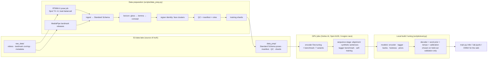
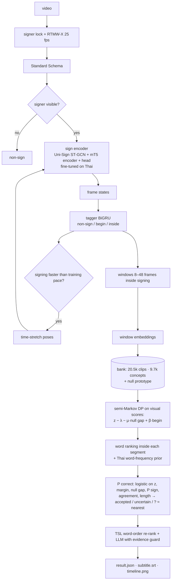

# ThaiSLM — Architecture v6 (data → standard schema → model → real-world inference)

**Scope:** how v6 is built, end to end, written so it can be reused in the project report. What changed from v5 is marked
**[v6]**. Results are in `result_v6.md`; the representation space in `latent_space_v6.md`; every file / column of the prepared
data in `cloud_s3/data_prep/SCHEMA.md` (= `s3://dsi490-lake-signdata/data_prep/SCHEMA.md`).

---

## 1. System at a glance

Repository entry point: `main.py` (infer · test · data · prep · cloud · eval · export-onnx).

---

## 2. Data sources

| source | what it is | modality in raw_data | clips (used) | signers | concepts | role in v6 |
|---|---|---|---|---|---|---|
| TTRS dictionary | national sign dictionary videos, Thai gloss + POS + category | mp4 | 5,042 | 9 (face-clustered in v4) | 4,686 | train / val / test (v4 signer-unit splits) |
| **th_sl (th-sl.com, NADT) [v6]** | dictionary of the National Association of the Deaf, 7,719 entries in 184 topic tags | mp4 (600×600, 24–50 fps) | 7,716 | 8 clusters (≈10–15 people) | 6,762 | train 5,175 · **val 1 signer (1,203)** · **test 1 signer (1,338)** |
| TSL-ONE-S | 29 signers × 184 glosses, MediaPipe Holistic 75 points | npy | 4,147 | 29 | 184 | train / val (3 signers) / test (5 unseen signers) |
| TSL51 experts | 2 interpreters + web dictionaries, 51 signs, MediaPipe 54 points | csv | 1,050 | 24 ids | 51 | train |
| TSL51 researcher | 1 signer, 51 signs + 76 sentence templates (252 videos) | csv + **mp4 (RTMW re-extracted)** | 544 + 547 / 252 + 252 | 1 | 51 / 62 sentences | **test signer**; sentences: tune / val / test templates |
| YouTube word lessons | title clips (24 signers) and speech-mined words (v4) | mp4 | 24 / 221 | 80 | 24 / 127 | test (title) / deployment bank only (mined) |
| **YouTube continuous [v6]** | Thai PBS Big Sign, sentence lessons, interpreted broadcasts — no per-word labels | mp4 | 102 videos (8.7 h) | ≈40 | – | tagger self-training · CSLS hubness reference |
| data_test | 5 real phone / web videos | mp4 | 5 | 5 | 21 in vocabulary | **never used for building or tuning** |

Totals of the Standard Schema: **19,897 usable clips / videos, 26.7 h of pose at 25 fps (22.7 h RTMW, the extractor used on real
video)**, 151 signer ids, **9,869 concepts, 1,969 with ≥ 2 signers** (v5: 11,542 isolated clips, 4,570 concepts, 605 multi-signer).

---

## 3. Data preparation — how every source becomes the same data

### 3.1 One extractor for all video [v6]

Every source that has video (TTRS, th_sl, TSL51 researcher, YouTube) is extracted with **the exact code path used at inference**
(`modules/wholebody.py`):

1. decode at 25 fps (long side ≤ 1280 px),
2. **signer lock**: YOLOX-tiny person detection every 8 frames + RTMPose-s body pose on every frame, hysteresis on
   (wrist confidence, box size, layout zone) so a second person or a cut-away does not steal the lock,
3. **RTMW-X** (133 whole-body points) on an upper-body box around the locked signer (hands get more pixels than on a
   full-person box), batched on the GPU.

v5 reused v4's TTRS poses (12.5 fps, up-sampled); v6 re-extracted TTRS at native 25 fps, so training poses and real-world poses
are produced identically. The job ran on 4 Spot T4 shards (CPU-bound work; ≈ $3.1 for 13,663 videos / 2.0 M frames) with the
multi-region load balancing described in §6. Two robustness fixes came out of it: per-session GPU-memory caps (one worker per
shard had hit a CUDA arena OOM on every clip) and a stall watchdog.

### 3.2 Standard Schema (introduced in v5 as CS5, unchanged format)

`kp [T,133,2]` (x/W, y/H) · `sc [T,133]` ∈ [0,1] · 25 fps · `hw` · extractor · imputed parts. Harmonisation removes every way a
model could tell sources apart other than the signing:

| problem | rule |
|---|---|
| three topologies (RTMW 133, MediaPipe 75 / 54) | mapped into the 133-slot layout; MediaPipe and COCO hand-21 share joint order |
| missing face / head points in MediaPipe sources | the 18 face points of **every** source are a mean face template placed per frame by a smoothed similarity on available anchors |
| TSL51 csv time axis is extraction wall-clock | time = row / metadata fps, resampled to 25 fps |
| TSL-ONE-S coordinates not normalised to the stated frame | per-clip aspect from body geometry |
| confidence scales / hand dropouts | clip to [0,1]; MediaPipe = 1.0; hand gaps ≤ 0.2 s interpolated for all |
| long broadcast videos (up to 27 min) **[v6]** | streaming extraction; the face-liveness step made linear (it was T×T memory) |

### 3.3 Labels: gloss → lemma → concept [v6 extension]

* TTRS / TSL51 / TSL-ONE-S: v5's reviewed table kept (rules, GPT-4.1 mapping of English glosses, manual review of kinship /
  places).
* **th_sl** entries are cleaned by rule (`modules/lexicon.thsl_lemma`): variant tags `(ท่าที่ 2)` / `(ท่ามือที่1 …)` / `(แบบที่ 2)` →
  `sign_variant`; sense notes `หยิก (แขน)`, `พบพระ (อำเภอ)` → `sense`; slash / comma entries `แต่งงาน/สมรส`, `ใหญ่, โต` = one sign → the
  names are synonyms by construction; bare numbers → Thai number words (`20` → ยี่สิบ).
* Synonym groups: only pairs that involve a *new* lemma are proposed (text-embedding neighbours) and verified by an LLM
  (interchangeable in translation, not broader / narrower); v5 decisions and the manual vetoes are kept → 3,187 decisions,
  373 "same", **313 multi-member concepts**, 9,445 concepts from the lexicon.
* A correction found this way: the prompt's analysis said th_sl has no ปรบมือ; it has two (`ปรบมือ (ท่าที่ 1)`, `ปรบมือ (หูหนวก) (ท่าที่ 2)`) —
  the parenthesised tags hid them. ไหม / มั้ย is in no source (only ไหม้ "burn", ไหมพรม "yarn", …).

### 3.4 Signer identity and held-out roles [v6]

th_sl has no signer column. Face crops (box from the body keypoints, 3 frames per clip) → DINOv2-base CLS → **centred** (removes
the component every face shares) → average-linkage clustering (cosine 0.7, conservative: may merge two people, never splits one)
→ 8 clusters, checked on a contact sheet (`data_prep/qc/thsl_signers.jpg`, not published). Held-out roles are **whole visually
pure clusters**: test = 1 signer (1,338 clips), val = 1 signer (1,203). A leakage check embedded 340 TTRS / TSL51 clips: none
resembles the held-out th_sl signers (0 above their own 10th-percentile similarity).

All v5 clips keep their v5 role (same TTRS / TSL-ONE-S / TSL51 / YouTube test sets) so v5 and v6 are compared on the same queries.

### 3.5 Quality control — only hard evidence of noise [v6]

Rules: < 8 frames · a "word" > 20 s · shoulders visible < 60 % (no signer in frame) · a hand visible < 25 % · no signing motion
(hands never above the waist **and** 95th-percentile wrist speed < 0.8 shoulder-widths/s) · no label · duplicate of another
source's video · undecodable video. A first version of the motion rule flagged 175 perfectly good TSL-ONE-S clips (tightly cut
clips that are *all* signing); it was replaced by the absolute rule above after inspecting their statistics.

Result: **58 clips excluded** (45 TSL51 web copies of th_sl videos, 2 th_sl body-part close-ups — foot, knee — with no signer, 1
corrupt video, 10 without visible hands / motion). The sources are clean; QC protects against duplicates and a few broken clips.

### 3.6 Shards

`data_prep/shards/pose_store.npz` (the 69 encoder slots of every used clip, float16, one offset table — 2.4 M frames, 1.0 GB) +
`clips.parquet` + `concepts.json`: the only thing a GPU job downloads.

---

## 4. Model

### 4.1 Sign encoder

Uni-Sign pose branch (ICLR 2025): part-wise ST-GCN over body 9 · hands 21+21 · face 18 → 768-d frames → mT5-base encoder
(top 8 layers trainable) → mean pooling → residual head → L2-normalised 768-d embedding. Loss: CosFace over concepts seen from
≥ 2 signers (+ the null class) + 0.5·SupCon; batches of 48 concepts × 2 instances, 85 % from a different signer / dataset /
extractor. **[v6]**: EMA of weights (0.998) for evaluation / checkpoints; GPU-OOM guard (a step that does not fit is dropped and
the batch shrinks); selection = mean new-signer MRR on three validation sets (TTRS val signers, TSL-ONE-S val signers, **th_sl val
signer — RTMW, like real video**).

**Encoder benchmark [v6, prompt_8]** — same data, losses, schedule and held-out protocols:

| variant | what differs |
|---|---|
| Uni-Sign CSL→WLASL (baseline init) | CSL-News pre-training → WLASL (ASL) isolated fine-tune → Thai fine-tune |
| Uni-Sign CSL only | the ASL step removed |
| scratch | same architecture, random weights (no sign-language prior) |
| Thai self-supervised | CSL→WLASL init → 1,500 steps of SSL on all Thai pose incl. 8.7 h unlabeled broadcasts (NT-Xent on time-shifted views + masked-pose reconstruction) → Thai fine-tune |
| + extractor-adversarial | gradient-reversal head that tries to tell RTMW from MediaPipe embeddings |
| + signer augmentation | per-sample shoulder / upper-arm / forearm / hand-size rescaling (hand follows its wrist) + 20 % mirroring (left-handed signer) |
| data ablations | without th_sl · without the MediaPipe-only sources |

### 4.2 Continuous signing

* **Forced alignment** of TSL51 sentence videos (every gloss in order, free null gaps) → pseudo word boundaries.
* **Synthetic sentences**: 2–6 isolated clips of one signer or across datasets, retargeted to one shoulder frame, speed
  0.9–1.7×, real rest / null segments, pauses, "no signer" blocks.
* **Tagger**: [frame states ‖ 13 kinematic features] → {non-sign, begin, inside}. **[v6]** benchmark BiGRU / dilated TCN /
  Transformer encoder; speed-perturbed copies (1.5×, 2×) of the real training sentences; **self-training**: the round-1 tagger labels
  the unlabeled broadcasts, only frames with P > 0.9 are kept, a round-2 tagger is trained with them. Decisions use held-out
  *tagger-val* templates (¼ of the tune templates), never the sentence test templates.

### 4.3 Spotting, word prior, tempo, calibration [v6]

* Windows 8–48 frames (stride 2) where the tagger says "signing"; concept score = mean of the top-2 instance similarities.
* **Segmentation and recognition are decoupled.** The semi-Markov DP (gain = z − λ − μ·null gap + β·P_begin, λ = 12, μ = 5, β = 5,
  min 12 frames) places segments on **visual scores only**; the word inside each segment is then ranked with
  **+ γ·Thai word-frequency prior** (Thai National Corpus, most frequent synonym of the concept, γ = 0.25). Priors inside the gain had
  over-split signs (exact count 0.64 → 0.38).
* **Tempo normalisation** (ref. word length 28 frames): if the tagger's median word is shorter, the poses are time-stretched ×1.5 / ×2,
  spotted, and times mapped back.
* **Calibration**: logistic P(correct) on the v5 features (z, score, margin, null gap, P(sign), agreement, support ratio, length),
  fitted on real tune + val sentences; accepted = precision ≥ 0.85 on that data.
* **Tried and not used** (reasons in `result_v6.md` §5.3): CSLS hubness correction (helps dictionary-style RTMW queries, hurts
  conversational sentences — the deployment target); bank depth as a ranking prior or calibration feature (it encodes which dataset
  recorded most signers — TSL-ONE-S's 29-signer vocabulary — and surfaced those words everywhere on real video); zero-shot +
  fine-tuned score fusion (lower validation score). The code for each remains (`modules/decode.py`, `scripts/eval.py`) and is off
  in `models/spotting.json`.
* Every decision is made on held-out validation data: the tagger-val TSL51 templates (conversational) for the decoder, the val
  signers of TTRS / TSL-ONE-S / th_sl for the encoder; the sentence-test templates and data_test are only reported.

### 4.4 Language layer (unchanged from v5)

Role-bigram re-ranker (TSL word order learned from TSL51, roles for 3,705 concepts incl. th_sl category tags) may move only
*uncertain* segments to a close 2nd/3rd candidate, enabled only if it lowers WER on tune sentences; the LLM sees candidates,
TSL templates and examples, and a deterministic evidence guard withholds unsupported sentences. Output tiers: `word` ·
`word?` · `[?] ≈ nearest`.

---

## 5. Deployment

`models/` holds everything inference loads (encoder.pt fp16 + mt5_config.json, tagger.pt, bank_deploy.npz, concepts.json,
null_proto.npy, freq_prior.npy (+ hub_deploy.npy / depth_deploy.npy, present but switched off), spotting.json, segment_calibration.json, grammar.json,
roles.json, face_template.npz, config.json) and **`models/onnx/`** for production: `encoder.onnx` (parts → embedding + frame
states), `tagger.onnx`, and the three pose models; ONNX Runtime matches PyTorch (cosine 1.000, max logit difference ~4e-6). The
bank is append-only: a new word or signer is one embedding appended to `bank_deploy.npz`.

## 6. GPU jobs and cost control

Project `gpu-job` has no L4 quota → Spot A100 (training) and Spot T4 (pose extraction, CPU-bound). `vertex.py launch`
submits the same job to every region with quota and cancels the others as soon as one starts (pending jobs are not billed).
Jobs stage data with the Cloud Storage client (the bucket mount was ~2 MB/s for small files), write outputs to the bucket as
they go (restartable), cap GPU memory per process, and have OOM guards. At the end of the round every object in the GCS bucket
is deleted (the bucket itself is kept).
