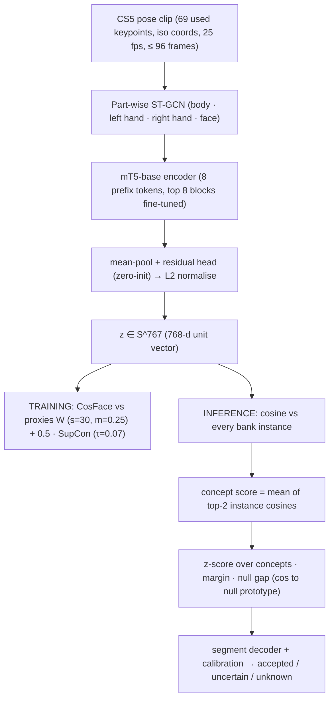

# ThaiSLM v5 — Latent Space & Vocabulary Bank Report (Stage 4)

**Scope.** รายงานนี้ดูเฉพาะ "พื้นที่ตัวแทน" (representation / latent / embedding space) ของ encoder v5 และ vocabulary bank ที่ใช้ค้นคำ —
หน้าตาของพื้นที่, คำเกาะกลุ่มกันอย่างไร, CosFace proxies ทำอะไรตอน training, ตอน inference ดึงคำจาก bank อย่างไร, และแม่นแค่ไหน

**Data.** ใช้ embedding จริงของ run ที่ deploy (`artifacts/v5/runs/train_all-20260914-170615-europe-west4`, best step 400):
11,622 isolated clips × 768-d (TTRS 5,036 · TSL-ONE-S 4,148 · TSL51 2,113 · YouTube 245 · ในนี้เป็น `<null>` 80 clips) ทั้งแบบ zero-shot (Uni-Sign ก่อน fine-tune) และ v5.
ทุกตัวเลขในรายงานคำนวณใหม่จากไฟล์เหล่านี้ด้วย `scripts/v5_latent_report.py` → `artifacts/reports/v5_latent_report.json`, รูปอยู่ใน `result_reporting/latent_v5/`.
ไม่มีการ tune อะไรบน data_test (ส่วน §8 เป็นการส่องดูอย่างเดียว).

---

## 1. สรุปสั้น (TL;DR)

| คำถาม | คำตอบ |
|---|---|
| พื้นที่หน้าตาเป็นอย่างไร | hypersphere 768-d (L2 norm = 1) ใช้งานจริง ~73 มิติ (participation ratio), คำเป็นกลุ่มก้อนเล็กแน่น แยกกันด้วยมุม |
| คำเกาะกลุ่มดีขึ้นไหม | ดีขึ้นชัด: คำเดียวกันต่างคน cos 0.60 → **0.70**, คำต่างกัน cos 0.20 → **0.06**; 92 % ของ concept "แน่นกว่าเพื่อนบ้านที่ใกล้ที่สุด" (zero-shot 61 %) |
| คนทำท่าต่างกันทำให้ปนไหม | แทบไม่: kNN-5 เป็นคนเดียวกัน 0.45 → 0.43 ขณะที่ kNN-5 เป็นคำเดียวกัน 0.78 → **0.84**; other-concept-same-signer ≈ other-concept-other-signer (0.065 vs 0.059) |
| CosFace ทำอะไร | ผลัก margin เชิงมุม: query ที่ห่าง prototype ผิดตัวที่ใกล้สุด ≥ m=0.25 เพิ่มจาก 5 % → **35 %**; prototype ของคำหลายคนแยกออกจากกัน (nearest-other cos median 0.73 → 0.66) |
| ความแม่นยำค้นคำ (held-out signer) | TSL-ONE-S R@1 0.81 → **0.88** (R@5 0.96); TSL51 MP 0.69 → 0.70 (R@5 0.90); RTMW 0.55 → 0.52; TTRS คนใหม่ 0.13 → 0.17; YouTube 0.29 → 0.36 |
| จุดอ่อน | คำที่มีคนทำใน bank แค่ 1–2 คน (R@1 ≤ 0.18), hub concepts ดึง error 24 %, pose คนละ extractor (RTMW) ยังห่าง, ท่าเร็ว/ต่อเนื่องใน data_test ตกไปใกล้คำอื่น |

---

## 2. พื้นที่ตัวแทนถูกสร้างและใช้อย่างไร

**Embedding.** ทุก clip (หรือทุก window ตอน inference) → vector 768 มิติความยาว 1; ความเหมือน = cosine = dot product.

**Vocabulary bank.** ไม่ใช่ classifier head — เป็นตาราง instance embeddings พร้อม concept id:

| bank | instances | ใช้ทำอะไร |
|---|---|---|
| eval bank | 8,672 (clip role = train เท่านั้น) | วัดผล held-out signer ทุกตัวเลขในรายงานนี้ |
| deploy bank | 12,843 (ทุก labeled clip + 1,301 คำที่ align จากประโยค TSL51) | ใช้จริงใน pipeline / lab.ipynb / data_test |
| null prototype | mean ของ `<null>` train embeddings (TSL51 null_act, rest, straddle) | บอกว่า window นี้ "ไม่ใช่ท่า" |

ข้อดีของ bank: เพิ่มคำ/คนใหม่ได้ทันทีโดยไม่ต้อง train ใหม่ (append embeddings), และแต่ละคำมีหลาย "ท่าย่อย" (variant) ได้เพราะใช้ top-2 instance ไม่ใช่ค่าเฉลี่ยเดียว.

**Concept vocabulary.** 4,570 concepts + `<null>`; ใน eval bank มี 4,528 concepts แต่มีเพียง **379** concepts ที่มี ≥ 2 signers (ที่เหลือ 4,149 มีคนทำคนเดียว ส่วนใหญ่จาก TTRS) — ตัวเลขนี้อธิบายหลายอย่างใน §5–6.

---

## 3. หน้าตาของ latent space ทั้งหมด

<b>Fig 1.</b> UMAP (cosine) ของทุก clip — ซ้าย zero-shot, ขวา v5. สี = dataset, × = null.

- **Zero-shot:** TSL-ONE-S (ส้ม) กระจายเป็นแถบยาวแยกจาก TTRS (น้ำเงิน) ค่อนข้างมาก — encoder เดิมยังจำ "ลักษณะ dataset" (มุมกล้อง, extractor) ได้.
- **v5:** พื้นที่หดเป็นแกนกลางเดียว มีเกาะเล็กๆ จำนวนมากรอบนอก — แต่ละเกาะคือ concept หนึ่งคำที่หลายคนทำแล้วรวมกันได้ (โดยเฉพาะ TSL-ONE-S และ TSL51). TTRS เป็นก้อนกลางเพราะ 1 คน/1 คำ ไม่มีแรงดึงให้รวมกลุ่ม.
- **null (×)** อยู่เป็นกลุ่มย่อยไม่กี่จุด (rest pose, ท่าเริ่ม/จบ) ไม่ใช่จุดเดียว → เหตุผลที่ใช้ null gap เป็นแค่ feature หนึ่ง ไม่ใช่ตัวตัดสินเดียว.
- **ข้อควรระวัง:** UMAP รักษาความใกล้ระดับเพื่อนบ้าน ไม่รักษาระยะไกล — ใช้ดู "การเกาะกลุ่ม" ได้ แต่ระยะระหว่างเกาะไม่มีความหมายเชิงปริมาณ (ตัวเลขจริงอยู่ §4–6).

## 4. การเกาะกลุ่มของคำ

### 4.1 คำเดียวกันจากหลาย dataset

<b>Fig 2.</b> 17 concepts ที่มี ≥ 3 clips ในอย่างน้อย 2 datasets (สุ่มไม่เกิน 12 clips ต่อ concept × dataset). marker = dataset.

- ทั้งสองแบบ concept ส่วนใหญ่เป็นเกาะแยกได้แล้ว (Uni-Sign pretrain ดีอยู่แล้ว) แต่ v5 ทำให้เกาะ **แน่นขึ้น** และ marker ต่าง dataset ซ้อนทับกันมากขึ้น (เช่น แม่, ไข่, ชื่อ, ทำงาน).
- `ย่า` กับ `ยาย` ซ้อนกันทั้งก่อนและหลัง — lexicon แยกเป็นคนละ concept (ความหมายต่าง) แต่ท่ามือคล้ายกันมาก → latent space บอกตรงๆ ว่าคู่นี้ต้องใช้บริบท/ท่าหน้าช่วย ไม่ใช่ pose มืออย่างเดียว.
- `โรงเรียน` ↔ `เด็ก` อยู่ใกล้กันใน v5 (ท่าเริ่มคล้ายกัน) — เป็นตัวอย่างคู่ที่ต้องดู margin ตอน inference.

### 4.2 ความไม่ขึ้นกับคนทำ (signer invariance)

<b>Fig 3.</b> TSL-ONE-S 14 concepts สุ่ม × 29 signers. จุด = คน train/val, ★ = 5 คน test ที่โมเดลไม่เคยเห็น.

★ ของคนใหม่ตกลงในเกาะของคำที่ถูกต้องเกือบทั้งหมด ทั้ง zero-shot และ v5; ใน v5 เกาะหดแน่นกว่าและ ★ อยู่ตรงกลางเกาะ แทนที่จะอยู่ขอบ (เช่น ครอบครัว, ภรรยา, ณ).

### 4.3 ตัวเลขการเกาะกลุ่ม

<b>Fig 4.</b> การกระจาย cosine ของทุกคู่ใน TSL-ONE-S 2,000 clips.

| ความสัมพันธ์ของคู่ clip | zero-shot mean (p10–p90) | v5 mean (p10–p90) |
|---|---|---|
| คำเดียวกัน · คนต่างกัน (ควรสูง) | 0.60 (0.31–0.85) | **0.70 (0.43–0.91)** |
| คำต่างกัน · คนเดียวกัน (ควรต่ำ) | 0.21 (0.07–0.37) | **0.07 (−0.07–0.22)** |
| คำต่างกัน · คนต่างกัน | 0.19 (0.07–0.35) | 0.06 (−0.08–0.21) |

| kNN-5 diagnostics (ทั้ง 11,622 clips) | zero-shot | v5 |
|---|---|---|
| เพื่อนบ้าน 5 ตัวเป็นคำเดียวกัน | 0.777 | **0.837** |
| เป็นคนเดียวกัน | 0.449 | 0.431 |
| เป็น dataset เดียวกัน | 0.936 | 0.951 |
| เป็น extractor เดียวกัน | 0.918 | 0.918 |

อ่านว่า: หลัง fine-tune คำต่างกันถูกผลักจนเกือบตั้งฉาก (cos ≈ 0.06) และ "คนเดียวกัน" แทบไม่ช่วยให้ใกล้กันอีก (0.065 vs 0.059) → **latent space ไม่ได้ปนตามตัวคน**. ส่วน same-dataset 0.95 ส่วนใหญ่มาจากว่าคำส่วนมากมีอยู่ใน dataset เดียว (ไม่ใช่ bias ล้วนๆ) — ดู cross-dataset check ใน §6.3.

### 4.4 ความแน่นของกลุ่ม vs ระยะเพื่อนบ้าน

<b>Fig 5.</b> 248 concepts ที่มี ≥ 3 instances ใน eval bank. แกน y = ความแน่น (cos เฉลี่ยของ instance กับ prototype ตัวเอง), แกน x = cos ของ prototype กับ prototype อื่นที่ใกล้สุด. เหนือเส้นประ = แยกได้.

| | zero-shot | v5 |
|---|---|---|
| median ความแน่น | 0.80 | **0.87** |
| median cos เพื่อนบ้านที่ใกล้สุด | 0.75 | **0.66** |
| concepts ที่อยู่เหนือเส้น (แน่นกว่าระยะเพื่อนบ้าน) | 61 % | **92 %** |

---

## 5. CosFace proxies

### 5.1 กลไก

ตอน training แต่ละ concept c (ที่มี ≥ 2 signers + `<null>`) มี proxy vector **w_c** (768-d, L2 norm) ใน matrix W ขนาด 4,571 × 768 (3.51 M params).
logit = s · (cos(z, w_c) − m·[c = y]) ด้วย s = 30, m = 0.25 → clip ต้องใกล้ proxy ของคำตัวเองมากกว่า proxy คำอื่น **อย่างน้อย 0.25 cos** จึงจะ loss ต่ำ.

- **Init:** w_c = mean ของ zero-shot embeddings ของ concept นั้น (ไม่ใช่สุ่ม) → เริ่มจากโครงที่ Uni-Sign มีอยู่แล้ว, gradient ช่วงแรกไม่ทำลาย pretrain.
- **ทำไมจำกัดเฉพาะ ≥ 2 signers:** concept ที่มีคนเดียว CosFace จะสอนให้จำ "คนนั้น+คำนั้น" (identity shortcut). concept พวกนี้ได้แค่ SupCon (ซึ่ง positive ต้องเป็น clip อื่น) + augmentation.
- **SupCon (0.5×):** ดึง clip คำเดียวกันใน batch เข้าหากันโดยตรง (P=48 concepts × K=2 clips, 85 % เลือกคนต่างกัน) → เสริมส่วนที่ proxy ไม่ครอบคลุม.
- **ตอน inference ไม่ใช้ W เลย** ใช้ bank instances แทน (เพิ่มคำใหม่ได้ + รองรับ variant). proxies จึงเป็น "นั่งร้าน" ที่ปั้นรูปทรงพื้นที่เท่านั้น.
- **ข้อจำกัดของรายงาน (ตรงไปตรงมา):** W ที่ train แล้วถูกเก็บเฉพาะใน `ckpt_last.pt` ซึ่งลบไปแล้วตอน cleanup (เก็บแค่ encoder best step 400). ดังนั้นวิเคราะห์ W โดยตรงไม่ได้ —
  ใช้ **proxy ตอน init (= zero-shot class mean)** และ **class mean หลัง fine-tune (≈ ตำแหน่งที่ proxy ถูกดึงไป)** เป็นตัวแทน. ถ้าต้องการ W จริงในอนาคต job_entry ต้อง export `proxies.npy` คู่กับ best checkpoint.

### 5.2 ผลที่เห็นในพื้นที่

<b>Fig 6.</b> ซ้าย: query จากคน test ของ TSL-ONE-S — cos กับ prototype ที่ถูก (y) vs prototype ผิดที่ใกล้สุด (x); จุดเหนือเส้นประ = ได้ margin ≥ m. กลาง: แต่ละ concept เคลื่อนจากตำแหน่ง init ไปแค่ไหน. ขวา: ระยะ prototype กับเพื่อนบ้านที่ใกล้สุด.

| TSL-ONE-S held-out queries (873) | zero-shot | v5 |
|---|---|---|
| mean cos กับ prototype ที่ถูก | 0.76 | **0.79** |
| mean cos กับ prototype ผิดที่ใกล้สุด | 0.69 | **0.63** |
| mean gap (ถูก − ผิด) | 0.08 | **0.16** |
| query ที่ได้ gap ≥ m = 0.25 | 5 % | **35 %** |
| query ที่ gap > 0 (prototype-level top-1) | 79 % | **86 %** |

- CosFace ได้ผลหลักจาก **การผลักคำผิดออก** (0.69 → 0.63) มากกว่าการดึงคำถูกเข้า (0.76 → 0.79).
- margin 0.25 บน train ไม่ได้ generalize ครบบนคนใหม่ (35 %) — เป็นเหตุผลที่ inference ใช้ z-score + margin + calibration แทน threshold ตายตัว.
- **Drift (กลาง):** concepts ที่อยู่ใน CosFace (≥ 2 signers) median cos(init, final) = 0.76 — เคลื่อนน้อยกว่าคำคนเดียว (0.66). ดูกลับหัวแต่มีเหตุผล: คำหลายคนมี class mean ที่เสถียร ส่วนคำคนเดียว mean = 1–2 clips ซึ่งขยับตาม augmentation/SupCon ทั้งก้อน.
- **Separation (ขวา):** nearest-other prototype median 0.73 → **0.66** (multi-signer), 0.69 → 0.63 (single) — ทั้งพื้นที่ "กว้างขึ้น".

### 5.3 มิติที่ใช้จริง

<b>Fig 7.</b> ซ้าย: cumulative explained variance ของ sign embeddings. ขวา: concept ที่เป็นคำตอบผิดบ่อยที่สุด (hub) ของ held-out queries ใน v5.

- participation ratio 84 → **73** มิติ, 90 % variance ที่ 247 → **163** components: v5 บีบข้อมูลลงมิติน้อยลง (ทิ้งมิติที่เก็บ style/กล้อง) แต่ยังเหลือพื้นที่มากพอสำหรับ ~4.5k concepts.
- **Hubness:** error 576 ครั้ง ไปตกที่ 243 concepts; top-10 hubs เก็บ 24 % (zero-shot 21 %). hub เป็นคำที่ท่าสั้น/เป็นกลาง (ไม่ใช่, ที่ไหน, ฎ) หรือคำยาวที่ครอบหลายท่า (ย้ายจากกรุงเทพฯ ไปภาคตะวันตก, แต่งงานกันเถอะนะ) → เหมาะกับการทำ hubness correction (CSLS) หรือ down-weight ใน v6.

---

## 6. การดึงคำ (retrieval) และความแม่นยำ

### 6.1 Recall@k บน signer ที่ไม่เคยเห็น

<b>Fig 8.</b> Recall@k ต่อ protocol (เส้นประ = zero-shot, เส้นทึบ = v5), open vocabulary ≈ 4.5k concepts, eval bank.

| protocol (open vocab) | n | R@1 zs → v5 | R@5 zs → v5 | R@10 v5 | MRR zs → v5 |
|---|---|---|---|---|---|
| TSL-ONE-S test signers | 873 | 0.811 → **0.880** | 0.953 → **0.961** | 0.971 | 0.875 → **0.916** |
| TTRS new signer (E1 test) | 60 | 0.133 → **0.167** | 0.283 → 0.267 | 0.317 | 0.208 → 0.237 |
| TSL51 researcher · MediaPipe | 524 | 0.695 → 0.698 | 0.903 → 0.899 | 0.947 | 0.786 → 0.786 |
| TSL51 researcher · RTMW | 524 | 0.552 → 0.515 | 0.809 → 0.775 | 0.855 | 0.667 → 0.634 |
| YouTube signers (E5) | 14 | 0.286 → **0.357** | 0.500 → 0.429 | 0.571 | 0.398 → 0.417 |

ตัวเลขเพิ่มเติมจาก `v5_isolated.json`: TSL-ONE-S closed-184 0.850 → 0.893; TSL51 closed-set MP 0.905 / RTMW 0.861.

อ่านผล:
- **เก่งมาก** เมื่อ bank มีหลายคนต่อคำ (TSL-ONE-S): เกือบ 9/10 ถูกอันดับ 1, 96 % อยู่ใน 5 อันดับ.
- **TSL51 RTMW ลดลงเล็กน้อย** — encoder ถูกดึงไปทาง dataset ที่ใช้ MediaPipe (TSL-ONE-S/TSL51) และ RTMW ของ TSL51 เป็น pose ที่ไม่มีใน train (researcher เป็น held-out). pipeline จริงใช้ RTMW → นี่คือช่องว่างที่สำคัญที่สุดสำหรับวิดีโอจริง.
- **TTRS/YouTube ต่ำ** เพราะ bank มีคำนั้นแค่ 1 คน (ดู 6.2).

### 6.2 ความลึกของ bank = ตัวกำหนดความแม่น

<b>Fig 9.</b> R@1 ของ held-out queries (รวม protocol, นับ clip researcher ครั้งเดียว) แยกตามจำนวน signers ของคำนั้นใน eval bank.

| signers ของคำใน bank | n queries | R@1 zero-shot | R@1 v5 |
|---|---|---|---|
| 1 | 68 | 0.13 | 0.18 |
| 2 | 21 | 0.14 | 0.00 |
| 3–5 | 435 | 0.58 | 0.51 |
| 6–15 | 415 | 0.78 | **0.85** |
| 16+ | 532 | 0.80 | **0.88** |

**ข้อสรุปที่สำคัญที่สุดของรายงาน:** ความแม่นขึ้นกับ "มีคนทำคำนั้นใน bank กี่คน" มากกว่าตัว encoder. ≥ 6 คน → 85–88 %; 1–2 คน → < 20 %.
ช่วง 3–5 คน (ส่วนใหญ่ TSL51 ที่ bank มีแค่ expert + web-scraped + ครู) v5 ลดลง 0.58 → 0.51 — encoder ไม่ได้แย่ลงโดยรวม แต่คำพวกนี้อยู่นอก CosFace/เห็น variant น้อย ทำให้ prototype ขยับไปทางที่ไม่ตรงกับ researcher.
ทางแก้ที่คุ้มสุด: **เพิ่ม instance ของคนหลากหลายเข้า bank** (ไม่ต้อง train ใหม่) — deploy bank ทำไปบางส่วนแล้ว (+1,301 คำจากประโยค TSL51 + test/val clips).

### 6.3 ข้าม dataset / ข้าม extractor / null

<b>Fig 10.</b> ซ้าย: cos กับ null prototype ของ TSL51 researcher (เส้น = sign clips, แท่งทึบ = null_act clips 23 clips). ขวา: cos ระหว่าง pose MediaPipe กับ RTMW ของวิดีโอเดียวกัน (524 คู่).

| | zero-shot | v5 |
|---|---|---|
| null vs sign AUC (MP / RTMW) | 0.83 / 0.86 | **0.89 / 0.90** |
| cos กับ null: sign clips (MP / RTMW) | 0.28 / 0.24 | **0.07 / 0.04** |
| cos กับ null: null clips (MP / RTMW) | 0.44 / 0.41 | 0.43 / 0.45 |
| วิดีโอเดียวกัน MP ↔ RTMW (median) | 0.81 | **0.84** |
| คำเดียวกัน คนละวิดีโอ MP ↔ RTMW | 0.75 | 0.76 |
| คู่สุ่ม | 0.15 | 0.06 |

- null แยกได้ดีขึ้นเพราะ sign clips ถูกผลักออกจาก null (0.28 → 0.07) ในขณะที่ null clips อยู่ที่เดิม; null_act ของ TSL51 กระจายกว้าง (0–1) เพราะ "ท่าไม่ใช่คำ" มีหลายแบบ.
- extractor gap: คู่ MP↔RTMW วิดีโอเดียวกันได้ 0.84 ≈ ระดับเดียวกับ "คำเดียวกันคนละคน" → ต่าง extractor เท่ากับเปลี่ยนคนทำหนึ่งคน. ยอมรับได้แต่ยังเป็นแหล่ง error.

Cross-dataset prototype check (`vocab/v5/cross_dataset_check.csv`): TSL-ONE-S → TTRS top-1 0.80 / top-5 0.96 (n 139); TSL51 → TTRS 0.73 / 1.00 (n 45); YouTube → TTRS 0.32 → การรวม gloss จากหลาย dataset เป็น concept เดียวยืนยันได้ด้วย latent space เองสำหรับ 2 datasets หลัก.

---

## 7. Inference: การดึงคำจาก bank ทีละขั้น

สำหรับแต่ละ window w (ยาว 8–48 frames, stride 2) ภายใน region ที่ tagger บอกว่าเป็นท่า:

1. `q = encoder(window)` → 768-d unit vector
2. cos(q, ทุก instance ใน deploy bank 12,843) — matrix product เดียวบน GPU
3. score(c) = mean ของ 2 instance ที่ใกล้สุดของ concept c (ถ้ามี instance เดียวใช้ตัวนั้น) — ทนต่อ outlier และรองรับหลาย variant
4. z = (top1 − mean(scores)) / std(scores); margin = top1 − top2; null_gap = cos(q, null) − top1
5. DP เลือก window ที่ไม่ทับกันด้วย gain = z − λ − μ·max(0, null − top1) + β·P_begin
6. logistic calibration บน [z, score, margin, null_gap, p_sign, agree, support, len] → P(correct) → accepted (≥ 0.46) / uncertain / unknown (< 0.05, แสดงเป็น `[?]≈คำใกล้สุด`)

ดังนั้นสิ่งที่ latent space ต้องให้ได้ตอน inference คือ **(a)** คำถูกอยู่ top-k, **(b)** ระยะห่าง top1–top2 และ z สูงพอให้ calibration มั่นใจ, **(c)** window ที่ไม่ใช่ท่าใกล้ null มากกว่าคำ.

## 8. ส่องดู data_test ใน latent space (ไม่ได้ใช้ tune)

แต่ละ segment ที่ pipeline (run B) ตรวจเจอ ถูก embed ใหม่ทั้งช่วง แล้วค้นใน deploy bank.
(หมายเหตุ: pipeline จริงเลือกจากหลาย window ย่อย ดังนั้น top-1 ของ segment ทั้งช่วงอาจต่างจาก `nearest` ใน result.json เล็กน้อย เช่น test1 #3.)

<b>Fig 11.</b> top-6 concepts ต่อ segment; เขียว = คำอ้างอิงของวิดีโอนั้น.

<b>Fig 12.</b> ★ = segment ของ data_test (สี: เขียว accepted, ส้ม uncertain, แดง unknown) วางลงบน UMAP ของ bank instances ของคำอ้างอิงและคำที่ตอบ.

| video | segment ที่ตกในเกาะคำถูก (top-1) | segment ที่หลุด และไปตกที่ไหน |
|---|---|---|
| test1 | สวัสดี 0.75, สบายดี 0.84, แมว 0.87 (ทั้งหมด accepted) | #3 ชอบ อันดับ 2 (0.58 vs 0.61) → unknown ถูกต้องที่ไม่รับ; #4 เสแสร้ง ใกล้ โกรธ (โกรธ อันดับ 4); #6–7 ไม่มีคำไหนเกิน 0.57 (แมว อยู่อันดับ 3 ใน #7) |
| ฉันปลอบเพื่อนร้องไห้ | เพื่อน 0.88 | ร้องไห้/ปลอบใจ มีใน bank แค่ 2 / 1 instance → ตกไปที่ ใบหน้า, สงสาร (uncertain) |
| ฉันรักเพื่อน | — | ตรวจเจอ segment เดียว (0.32–2.24 s) → ตกกลางกลุ่มกีฬา (มวยปล้ำ 0.58); `รัก` มี 2 instances |
| พ่อดื่มน้ำ | น้ำ อันดับ 2 (0.55) ใต้ ตา | พ่อ ไม่ติด top-20; ดื่ม (3 instances) อันดับ 4 ใต้ พูดเสียงดัง |
| ไปทานข้าวด้วยกันมั้ย | กิน 0.87, ไป 0.80, ฉัน 0.92 | ด้วยกัน อันดับ 4 ใต้ เที่ยว 0.68; ท่าเปิด ตกที่ตัวอักษร อ |

Fig 13 (heatmap) แสดงว่าความผิดพลาดส่วนใหญ่ **ไม่ใช่** เพราะ prototype ของคำถูกกับคำผิดซ้อนกันใน bank — cos ระหว่าง prototype ส่วนมาก < 0.3; คู่ที่ใกล้จริงมีไม่กี่คู่ (น้ำ↔ตา 0.65, ดื่ม↔พูดเสียงดัง 0.59, รัก↔มุกดาหาร 0.59, ปลอบใจ↔รัก 0.53).
ปัญหาหลักคือ **query ของ data_test ตกออกนอกเกาะ** (ท่าเร็ว, co-articulation, segment ครอบหลายคำ) และ **คำที่ bank มี instance 1–3 ตัว** (ปรบมือ 1, ปลอบใจ 1, ร้องไห้ 2, รัก 2, ดื่ม 3) — สอดคล้องกับ §6.2.

<b>Fig 13.</b> cosine ระหว่าง prototype (deploy bank) ของคำอ้างอิง data_test (ซ้ายบน) กับคำตอบผิดที่พบ (ขวาล่าง). แสดงตัวเลขเมื่อ &gt; 0.5.

---

## 9. ข้อสรุปและสิ่งที่ควรทำต่อ

**สภาพของ latent space v5**
1. เป็นพื้นที่ที่ดี: คำเดียวกันจากคนต่างกันรวมกลุ่ม (cos 0.70), คำต่างกันเกือบตั้งฉาก (0.06), ไม่ปนตามคนทำ, null แยกได้ AUC 0.89–0.90.
2. CosFace + SupCon เพิ่ม margin จริง (gap 0.08 → 0.16, query ที่ได้ margin ≥ m 5 → 35 %) และขยายระยะระหว่าง prototype.
3. ความแม่นในทางปฏิบัติถูกจำกัดโดย **ความลึกของ bank** (1–2 คน → < 20 %, ≥ 6 คน → 85–88 %), **extractor gap (RTMW)** และ **query ที่หลุดเกาะจากการทำท่าต่อเนื่อง**.

**ข้อเสนอ (เรียงตามความคุ้ม)**
- เพิ่ม instance เข้า deploy bank สำหรับคำที่ใช้บ่อยแต่มี < 3 คน (ร้องไห้, รัก, ปลอบใจ, ดื่ม, ปรบมือ ...) — ไม่ต้อง train ใหม่.
- ทำ bank แบบคู่ extractor: embed clip MediaPipe ด้วย RTMW pose ของวิดีโอเดียวกันเมื่อมีวิดีโอดิบ (TSL51 ทำแล้ว) เพื่อลด gap 0.84.
- hubness correction (CSLS: ลบค่าเฉลี่ยความใกล้ของ concept กับ query ทั่วไป) สำหรับ hub 10 ตัวที่กิน error 24 %.
- บันทึก CosFace proxy matrix W คู่กับ best checkpoint ใน job ต่อไป เพื่อวิเคราะห์ proxy จริงและใช้เป็น prior สำหรับคำที่ bank บาง.
- เพิ่ม fast/co-articulated sign augmentation (window ที่ตัดจากประโยค) เพื่อให้ query จากวิดีโอจริงตกในเกาะ.

## Appendix — ไฟล์และการ reproduce

| item | path |
|---|---|
| script | `scripts/v5_latent_report.py` (ใช้ GPU เฉพาะ §8) |
| statistics | `artifacts/reports/v5_latent_report.json` |
| figures | `result_reporting/latent_v5/f1…f13_*.png` |
| embeddings | `artifacts/v5/runs/train_all-20260914-170615-europe-west4/emb_v5.npy`, `emb_zero_shot.npy`, `emb_index.parquet`, `concept_index.json` |
| banks | `artifacts/v5/model/bank_eval.npz`, `bank_deploy.npz`, `null_proto.npy` |
| rendering | `python scripts/md_to_pdf.py result_reporting/latent_report_v5.md` |

Metric definitions: R@k = สัดส่วน query ที่ concept ถูกอยู่ใน k อันดับแรกของ concept scores (top-2 instance mean) โดยตัด `<null>` ออก; MRR = ค่าเฉลี่ย 1/rank;
prototype = L2-normalised mean ของ instances ของ concept ใน bank; participation ratio = (Σλ)² / Σλ² ของ covariance eigenvalues; kNN diagnostics จาก `v5_isolated.json`.
