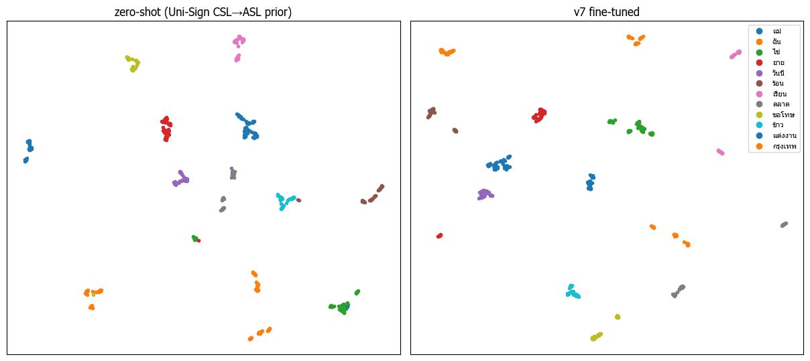
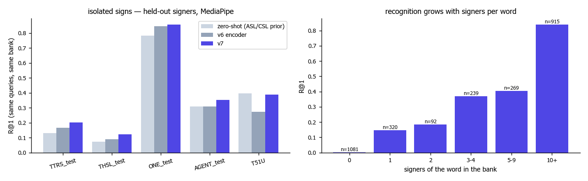

# ThaiSLM — Latent space v7 (what the encoder learned, and where it still fails)

All numbers come from the same queries and the same train-only bank, with MediaPipe landmarks (`artifacts/reports/isolated.json`,
`lab.ipynb` §3).

## 1. Is the space organised by sign?

UMAP of 12 frequent concepts (≤ 60 clips each). The zero-shot Uni-Sign space already groups many clips by sign, but several
concepts split into far-apart islands (one per dataset or signer). After v7 fine-tuning the clusters are tighter and better
separated. Some concepts still have 2–3 islands, which are real sign variants (TTRS vs th_sl vs TSL-ONE-S often sign a word
differently).

| 5-NN neighbourhood (held-out + train clips) | zero-shot | v6 | **v7** |
|---|---|---|---|
| same concept | 0.322 | 0.362 | **0.364** |
| same signer | 0.255 | 0.227 | **0.231** |
| same dataset | 0.732 | 0.689 | 0.703 |

Concept agreement rises and signer agreement falls relative to zero-shot. The space is still dominated by **dataset** (0.70),
because each dataset records a different signing style and recording set-up. This is the main reason a word with only one source
is hard to recognise for a new person.

## 2. The extractor gap (P5) — closed by design

v6 trained mostly on RTMW poses but served MediaPipe from the browser. v7 trains on MediaPipe for every video and serves the same
model file, so the gap is gone at inference. RTMW views are kept as extra positives. The two views of the same clip now embed
closer (cosine 0.815 zero-shot → **0.848**; random clips 0.18 → 0.02).

## 3. Does fine-tuning learn TSL, or lean on the ASL / CSL prior?

| | v6 | v7 |
|---|---|---|
| error rate on held-out test queries (n 1,835) | 0.486 | **0.440** |
| errors that repeat a zero-shot confusion, per query | 0.167 | 0.171 |
| share of errors inherited from zero-shot | 34 % | 39 % |
| CKA zero-shot vs fine-tuned | – | 0.66 |

v7 fixes more errors overall. The confusions the ASL/CSL prior already made are the hardest ones and stay at the same absolute
level. Their share rises because the others went away. Hard negatives target confusable pairs but did not remove these. They are
mostly pairs that look alike in pose space (same handshape and location, different movement) and have few Thai signers. More
Thai signers per word would help more than a stronger loss.

## 4. Bank depth — still the strongest lever

R@1 by signers of the word in the bank: 1 → 0.15, 2 → 0.18, 3–4 → 0.37, 5–9 → 0.41, 10+ → 0.84. The harvest raised the
daily-conversation words with 3–4 signers from 58 to 88 (`figures_v7/data.png`). That is where the AGENT_test and
TSL51-daily gains come from.

## 5. Not-a-sign

Null vs sign AUC on the TSL51 researcher fell from 0.82 (zero-shot) to 0.71 (23 null clips). Fine-tuning pulls every
hand-moving clip toward some sign. In continuous use, the tagger (P(sign)), the transition post-filter and calibration decide
what is a sign, which is why the extra segments on hand transitions dropped (segment F1 0.793 → 0.866) despite the lower AUC.

## 6. What would change the space most (evidence-based)

1. **More signers per daily word.** It is the steepest curve in §4. The 173 daily words with < 3 signers are the target list
   (`vocab/daily_conversation_depth.csv`).
2. **Natural-pace sentence data** with word timings, because isolated dictionary clips do not show co-articulation (real phrases:
   R@1 0.07).
3. **Dataset-invariance:** sampling positives across datasets for the same concept. A signer adversary was tried in v6 and did not
   help, so the data side comes first.
