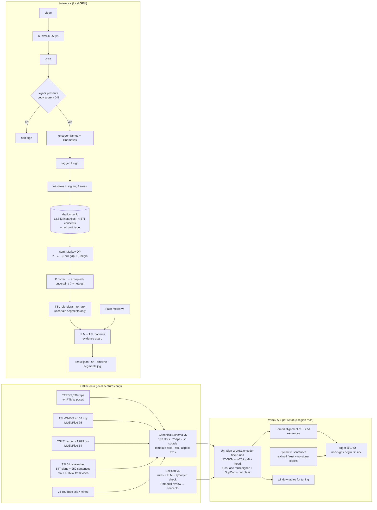

# ThaiSLM — Result Report v5

**Scope:** v5 = v4 + two pre-extracted multi-signer datasets (TSL51, TSL-ONE-S), one canonical pose schema for all sources, a unified
gloss→concept lexicon, a fine-tuned (not frozen) sign encoder, a continuous-signing tagger trained on real sentences with an explicit
non-sign class, recognition-driven spotting with a null competitor, calibrated word status, TSL word-order patterns in the language
layer, and GPU jobs on Vertex AI. Everything in this report is in this one file (architecture included).
**Environment:** `conda activate hugging` (local, RTX 2050) · Vertex AI Spot A100 40 GB (training jobs) · OpenAI for lexicon/LLM layer.
**Executed notebooks:** `notebooks/v5/00…08`. **Main code:** `modules/{schema_v5,lexicon_v5,encoder_v5,sequence_v5,decode_v5,grammar_v5,translate_v5,pipeline_v5}.py`,
`scripts/{v5.py,v5_eval.py,v5_infer.py,make_notebooks_v5.py}`, `GCP/script/{vertex.py,job_entry.py,gcp_common.py,follow_logs.py}`.

---

## 0. TL;DR

| Question | Answer |
|---|---|
| Was the new data merged with the old corpus? | Yes. **12,131 clips in one Standard Schema v5 table**: TTRS 5,036 (v4 RTMW poses re-used, not re-extracted) + TSL-ONE-S 4,148 (4,152 files; 4 unlabeled) + TSL51 1,099 expert originals + TSL51 researcher 547 signs / 252 sentences (both the dataset's MediaPipe csv and our own RTMW from the videos) + v4 YouTube 245 + data_test 5. **4,570 concepts, 605 with ≥ 2 signers** (v4: 412 words). |
| Data conflicts found | Four real ones, all measured and fixed before training: (1) TSL51 `t_ms` is extraction wall-clock, not media time (clips stretched up to 3×); (2) TSL-ONE-S coordinates are *not* normalised to 1280×720 (hands ~1.9× too wide) → per-clip aspect from body geometry; (3) three topologies (133 / 75 / 54 points, 2-D vs 3-D, face points missing) → one 133-slot schema with a shared face template; (4) 55 TSL51 "scraped" clips are copies of our TTRS clips → removed (leakage). |
| Did fine-tuning work this time? (v4's adapter did not) | **Yes on multi-signer vocabulary.** Held-out signers, full ~4.5k-concept vocabulary: TSL-ONE-S R@1 **0.811 → 0.880**, TTRS E1 test **0.133 → 0.167**, YouTube signers 0.29 → 0.36, null-vs-sign AUC 0.86 → 0.90. Signer clustering in the space dropped sharply (cos other-sign/same-signer 0.21 → 0.065). No gain for TSL51 words from RTMW poses (0.55 → 0.52 open-vocab; closed 51-sign set 0.86 both). |
| Continuous signing (held-out real sentences) | TSL51 templates never used for tuning, RTMW poses (same extractor as data_test): **segment F1 0.84, exact word count 71 %, count error 0.35/sentence, word recall@1 0.47 / @5 0.72, WER 0.52 → 0.47 with the learned TSL word-order re-ranker**. MediaPipe version: WER 0.33 → 0.32. |
| Non-sign detection (intro, title cards, pauses) | test1.mp4: **7 segments for the 7 signed words, 0 segments on the ~18 s of title cards / intro / credits**. Held-out synthetic sentences with rest + "no signer" blocks: sign-frame F1 0.99. |
| data_test (5 videos, 22 reference words, 21 in vocabulary) | **Final (run B): 20 segments for 22 signs; reference word top-1 in some segment 7/22 (0.32), in top-5 10/22 (0.45).** First run (A): 0.36 / 0.50. Correct and accepted: สวัสดี, สบายดี, แมว (test1), เพื่อน, กิน, ไป; ชอบ is correct top-1 but reported "[?] ≈ ชอบ" (low confidence). v4 on its 2 videos: 1 word at #1. |
| Does it still guess? | Every segment is `word` / `word?` / `[?] ≈ nearest`; the LLM may only use a segment's candidates; the evidence guard withholds sentences. The LLM used only candidate words (0 guard violations) and in test1 even picked the correct โกรธ (#2) over the visual top-1. **But:** on data_test 6 accepted words are not in the reference (เสแสร้ง, ดี, พูดเสียงดัง, the letter อ, ฉัน, เที่ยว) and 2 wrong sentences were shown (เพื่อนใบหน้าดูสงสาร, ฉันเที่ยวกินไป). Accepted-tier precision is 0.76 on held-out real RTMW sentences, i.e. ~1 in 4 accepted words is still wrong. |
| What limits recognition now | Bank depth per word. Test words with ≥ 4 signers in the bank were found (สวัสดี, สบายดี, ชอบ, แมว, ไป, กิน, เพื่อน); words with 1–3 examples were not (ปรบมือ, ปลอบใจ, ร้องไห้, รัก, ดื่ม, น้ำ). Also fast phone-video signing (ฉันรักเพื่อน: 3 signs in 1.9 s → 1 segment) and the RTMW↔MediaPipe extractor gap for TSL51 words. |
| GCP | L4 quota is 0 in every region (on-demand and Spot) → Spot A100 with a 3-region race. **86.5 GPU-min, ≈ $2.2** for all v5 jobs incl. failed/cancelled ones; no job left running. |

---

## 1. v5 blueprint — what changed and why

v4 said: word identity on a new signer is the bottleneck (1 signer for most words), the tagger never saw real continuous signing,
rest/transition had no class, and only 2 test videos. v5 attacks exactly those.

| v4 limitation | v5 answer |
|---|---|
| 3 TTRS signers; 412 words with ≥ 2 signers | + TSL-ONE-S (29 signers × 184 glosses) + TSL51 (2 interpreters, 2 web dictionaries, 1 researcher) → **605 concepts with ≥ 2 signers**, 11,542 labelled isolated instances |
| frozen encoder + adapter did not generalise | **Uni-Sign encoder fine-tuned** (ST-GCN + top 8 mT5 layers + residual head) with concept-level CosFace (multi-signer concepts only) + SupCon, cross-signer/cross-dataset positives |
| incompatible pose formats | **Canonical Schema v5 (CS5)**: one 133-slot format, 25 fps, isotropic coordinates, harmonised face, every conflict measured |
| synonyms / English labels / school tags split one word into several | **lexicon v5**: rules + LLM + embedding-verified synonym groups + manual review → concepts, checked against sign similarity |
| tagger trained only on synthetic TTRS concatenations | tagger trained on **real TSL51 sentences (forced-aligned)** + synthetic sentences with **real null/rest clips and "no signer" blocks** |
| hands-to-rest accepted as a word | **null class** in the embedding + null competitor in spotting + **P(correct) calibration on real continuous signing** |
| LLM saw a bag of candidates | LLM sees **TSL word-order patterns learned from TSL51** + gloss-order → Thai examples; deterministic evidence guard kept; role-bigram re-ranker (enabled because it lowered WER on tune sentences) |
| RTX 2050, 4–5 h training | **Vertex AI Spot A100** (features only uploaded), resumable jobs, 3-region race, local inference |

Design principle kept from v4: **tune only on held-out signers / held-out templates / synthetic data, never on data_test**; data_test is
run, scored, and diagnosed. Where a diagnosis on data_test motivated a change (signing speed, calibration domain), the change itself was
decided on tune data and both runs are reported (§10).

---

## 2. Architecture v5 (current, end to end)



| layer | module | v5 decision |
|---|---|---|
| L0 schema | `schema_v5.py` | 133-slot Uni-Sign layout; x·W/H isotropic units; face 18 points from a mean template placed by per-frame similarity (all sources); MediaPipe gaps ≤ 0.2 s interpolated; 25 fps |
| L0 lexicon | `lexicon_v5.py` | concept = synonym group; bank scores concepts |
| L2 encoder | `encoder_v5.py` | fine-tuned Uni-Sign; mean-pooled ctx + residual head; embedding 768-d L2 |
| L3 tagger | `sequence_v5.py` | [frame states 768 ‖ kinematics 13] → 2-layer BiGRU → non-sign / begin / inside |
| L3 spotting | `decode_v5.py` | windows 8–48 frames, DP gain = z − λ − μ·max(0, null − top1) + β·P_begin; λ = 8, μ = 5, β = 5, γ = 0.5, min_len = 20 |
| L4 status | `decode_v5.py` | logistic P(correct) from z, score, margin, null gap, tagger P(sign), ensemble agreement, support ratio, length; accepted ≥ 0.46, uncertain ≥ 0.05 |
| L5 language | `grammar_v5.py`, `translate_v5.py` | role-bigram re-rank (weight 0.5), LLM with TSL templates/examples, evidence guard |
| app | `pipeline_v5.py`, `scripts/v5_infer.py` | `python scripts/v5_infer.py --video X.mp4` |

---

## 3. Data: sources, how they are combined, conflicts

### 3.1 Sources and roles (Standard Schema v5, `artifacts/v5/clips_v5.parquet`)

| dataset | subset | extractor | clips | signers | role |
|---|---|---|---|---|---|
| TTRS dictionary (old raw_data, v4 poses) | ttrs | RTMW-133 | 4,844 / 97 / 95 | 8 | train / val / test (v4 signer-unit splits) |
| TSL-ONE-S | 8 categories | MediaPipe 75 | 2,763 / 512 / 873 | 21 / 3 / 5 | train / val / **test = 5 unseen signers** (official split mixes all signers, so a signer-held-out split was made) |
| TSL51 experts | primary (2 interpreters) + web (th-sl, Royal Society) | MediaPipe 54 | 1,032 + 67 | 2 + 67 | train (55 TTRS copies removed) |
| TSL51 researcher signs | user_sign (+ own RTMW) | MP 54 / RTMW | 547 + 547 | 1 | **test signer** (both extractors; 23 null clips) |
| TSL51 researcher sentences | user_sentence (+ own RTMW) | MP 54 / RTMW | 252 + 252 | 1 | 38 templates → tagger/tune, 38 templates → **sentence test** |
| YouTube (old raw_data, v4) | title clips / speech-mined | RTMW | 24 / 221 | 24 / 56 | test (E5) / deployment bank only |
| data_test | 5 videos | RTMW 25 fps | 5 | — | never used for building |

Old raw_data that is **not** used: broadcast/continuous YouTube (no per-word labels), v1 RGB features, unlabeled lessons.

### 3.2 Conflicts measured on the data and how CS5 resolves them

| conflict | evidence | resolution |
|---|---|---|
| topology | RTMW 133 (score) · TSL-ONE-S pose33 + hands, x/y, zeros = missing · TSL51 6 arm + 4 brow + 2 mouth + hands, x/y/z, NaN | map into Uni-Sign's slots (body 9, hands 21+21, face 18); hand-21 joint order identical in MediaPipe and COCO-WholeBody |
| handedness / mirroring | left hand root ↔ left wrist in 100 % of sampled frames in all three sources; shoulders x(left) > x(right) | 1:1 mapping, no flip |
| missing face / head points | MediaPipe sources lack jaw / inner mouth; TSL51 lacks nose / eyes / ears | **mean face template** (Procrustes mean of 40k TTRS frames) placed per frame by a smoothed similarity on the anchors each source has — for every source, RTMW included, so the model cannot tell datasets apart by face detail; real mouth corners kept; TSL51 nose/eyes/ears imputed (flagged) |
| **TSL51 time axis** | csv rows = video frames, but `t_ms` is the extraction loop clock: a 13.0 s / 391-frame video spans 15.9 s; expert clips up to 3× | time = row / metadata fps (30 primary, 50 th-sl, 25–50 Royal Society). After the fix MediaPipe and RTMW versions of the same videos have identical length (41,039 vs 41,045 frames). Zero-shot TSL51 closed-set R@1 0.88 → 0.91 |
| **TSL-ONE-S frame** | assuming the paper's 1280×720: shoulder-width / mouth-drop = 4.6; anatomically ≈ 2.4 in every source with a known frame (TSL51 experts at 1920×1080, 600×600, ~1180×950; TTRS RTMW 2.43). Per-signer ratio at aspect 1 ranges 1.9–4.4 (several cameras) | per-clip aspect = 2.40 / ratio, shrunk 50 % toward the signer median (aspects p5/50/95 = 0.63 / 0.92 / 1.21). Independent check: hand size / shoulder width 0.19 → **0.245**, now matching all other sources (0.22–0.30). Zero-shot TSL-ONE-S closed R@1 0.78 → 0.85 |
| frame rate | 12.5 (v4 TTRS) · 25 (our RTMW) · 29.97 (TSL-ONE-S) · 30/50 (TSL51) | resample to 25 fps on each source's own time axis |
| confidence | RTMW scores 0–1.1; MediaPipe presence only; MediaPipe loses hands (TSL51 hand presence 26–59 %) | clip to [0, 1], MediaPipe detections = 1, gaps ≤ 0.2 s interpolated; training augmentation randomly binarises RTMW confidences and drops hands for 6–15 frames |
| duplicates | TSL51 "web-scraped / ttrs" = our TTRS videos | 55 clips removed |

Schema audit after harmonisation (`reports/v5_schema_audit.json`, figure `result_reporting/v5_schema_sources.png`, notebook 00):
hand-over-shoulder ratio 0.22–0.30 for every source; RTMW sources have ~100 % hand presence, MediaPipe 46–99 %.

---

## 4. Lexicon v5 and vocabulary bank

### 4.1 Gloss → lemma → concept (`vocab/v5/gloss_mapping.csv`, `concept_groups.csv`)

| source | how | glosses |
|---|---|---|
| TTRS | gloss, school annotations stripped into `sign_variant` (e.g. "ตลาด (ภาษามือวิทยาลัยราชสุดา)"), 3 corrupted labels fixed | 4,591 |
| TSL51 | `ฉัน_var_2 → ฉัน` (variant kept), `null_act → <null>` | 52 |
| TSL-ONE-S | 42 consonant names (Gor Gai → ก …), 7 vowels, 11 numbers by rule; 124 by GPT-4.1 with the 20 nearest TTRS lemmas as candidates; 10 corrected by manual review | 184 |

- **Synonym groups:** text-embedding neighbours → 1,152 candidate pairs → LLM keeps only interchangeable pairs → 89 groups (กิน = ทาน = รับประทาน, ประเทศเวียดนาม = เวียดนาม, บาสเกตบอล = บาสเก็ตบอล, วัดโพธิ์ = วัดพระเชตุพน, ไหม = มั้ย …).
- **Manual review** vetoed wrong LLM decisions: ย่า ≠ ยาย, ลูก ≠ เด็ก, ลูกพี่ลูกน้อง ≠ ญาติพี่น้อง, Victory Monument ≠ วงเวียนใหญ่, Football ≠ ลูกบอล, Country ≠ ประเทศไทย, กางเกง ≠ กางเกงใน.
- **Check against the signs themselves** (fine-tuned space, `vocab/v5/cross_dataset_check.csv`): the TSL-ONE-S prototype of a concept is nearest to the TTRS prototype of the *same* concept for **80 %** of shared concepts (top-5: 96 %); TSL51 → TTRS 73 % (top-5 100 %). This also resolved the undocumented kinship pairing: Grandpa → ตา (nearest TTRS sign ตา 0.66), Grandma → ยาย (0.83), Grandmother → ย่า (0.77); uncles/aunts ลุง 0.86, ป้า 0.71, น้า 0.78, อา 0.83. Outliers are regional/school sign variants with the same meaning (Grandfather→ปู่ 0.48, Volleyball 0.22, One 0.40) — kept, noted.

### 4.2 Bank (`artifacts/v5/model/bank_{eval,deploy}.npz`, `vocab/v5/vocab.csv`)

| | instances | concepts | purpose |
|---|---|---|---|
| eval bank | 8,672 | train-signer clips only | every number in §5–§8 |
| deploy bank | 12,843 | all labelled clips (+ 1,301 confidently aligned TSL51 sentence words, top 75 % alignment score) | data_test / real use |

605 concepts have ≥ 2 signers (TTRS 4,511 concepts, TSL-ONE-S 184, TSL51 50, YouTube 148). data_test words in vocabulary: 21/22 (**ไหม** is absent from all sources).

---

## 5. Encoder: zero-shot Uni-Sign vs v5 fine-tuning

**Setup** (job `train_all-20260914-170615-europe-west4`): Uni-Sign WLASL-ISLR weights; trainable ST-GCN (lr 1e-4), top 8 mT5 layers (2e-5),
residual head initialised to identity (5e-4). Batch = 48 concepts × 2 instances (85 % different signer/dataset/extractor) + 8 % null
windows (TSL51 null_act, rest before/after isolated signs, windows straddling two signs). Loss = CosFace (s 30, m 0.25; **only concepts
seen from ≥ 2 signers + null**, proxies initialised from zero-shot class means) + 0.5 · SupCon (τ 0.07). Augmentation: speed 0.75–1.35,
trimming, affine, RTMW-like jitter, MediaPipe-like binary confidence / hand dropouts. Model selection = 0.5 · TTRS E1 val MRR + 0.5 · TSL-ONE-S val MRR.

**Training curve:** the best validation score was at **step 400** (0.566); steps 800/1200 were flat and step 1600 fell (0.533, TTRS E1 val
R@1 0.15 → 0.10: overfitting). The job was cancelled at ~1,600/4,000 steps; the step-400 checkpoint is the model. (A first attempt with
batch 207 hit CUDA OOM; a 2nd was cancelled to fix the two data bugs; §11.)

**Held-out-signer retrieval** (`reports/v5_isolated.json`, notebook 02; bank = train signers, open vocabulary ≈ 4.5k concepts unless "closed"):

| protocol | n | zero-shot R@1 | **v5 R@1** | zero-shot R@5 | v5 R@5 | v5 MRR |
|---|---|---|---|---|---|---|
| TSL-ONE-S test (5 unseen signers), open | 873 | 0.811 | **0.880** | 0.953 | 0.961 | 0.916 |
| TSL-ONE-S test, closed 184 | 873 | 0.850 | **0.893** | 0.973 | 0.977 | 0.931 |
| TSL-ONE-S val (3 signers), open | 512 | 0.787 | 0.863 | 0.938 | 0.969 | 0.912 |
| TTRS E1 test, bank = all train | 60 | 0.133 | **0.167** | 0.283 | 0.267 | 0.237 |
| TTRS E1 test, bank = TTRS train | 60 | 0.117 | 0.183 | 0.267 | 0.267 | 0.246 |
| TTRS E1 val (small) | 60 | 0.183 | 0.150 | 0.333 | 0.267 | 0.220 |
| v4 protocol (seen_test_queries, TTRS bank) | 56 | 0.125 | 0.179 ± 0.10 | 0.268 | 0.268 | 0.242 |
| YouTube title clips (E5, new signers) | 14 | 0.286 | 0.357 | 0.50 | 0.43 | 0.417 |
| TSL51 researcher, MediaPipe, open | 524 | 0.695 | 0.698 | 0.903 | 0.899 | 0.786 |
| TSL51 researcher, MediaPipe, closed 51 | 524 | 0.905 | 0.905 | 0.994 | 0.983 | 0.942 |
| TSL51 researcher, **RTMW**, open | 524 | **0.552** | 0.515 | 0.809 | 0.775 | 0.634 |
| TSL51 researcher, RTMW, closed 51 | 524 | 0.865 | 0.861 | 0.989 | 0.979 | 0.914 |
| null vs sign AUC (MP / RTMW) | 547 | 0.83 / 0.86 | **0.89 / 0.90** | | | |

Reading it honestly:
- The multi-signer signal works where it exists: +7 points R@1 on 5 completely new TSL-ONE-S signers over a 4.5k-concept vocabulary, +3–7 points on TTRS new-signer and YouTube queries (small n, CI ± 0.1).
- For comparison only (different split): the TSL-ONE-S paper reports SPOTER 80.8 % / I3D 79.7 % top-1 on 184 classes; v5 gets 89.3 % closed-set on signers that are not in training at all.
- v4 reported E1 test R@1 0.196 (n = 56, real face, 12.5→25 fps). v5 is 0.179 on the same queries with a TTRS-only bank: within noise. The harmonised face costs some TTRS-internal accuracy; it was accepted because cross-dataset consistency matters more for real use.
- The **extractor gap** remains: the same TSL51 videos score 0.70 open-vocab with MediaPipe poses and 0.52 with RTMW poses, because TSL51 words in the train bank are MediaPipe-only. The deploy bank therefore also contains RTMW versions of those words (§4.2).

---

## 6. Is the latent space organised by sign? (notebook 03, `result_reporting/v5_latent_space.png`)

| held-out clips | zero-shot | v5 |
|---|---|---|
| 5-NN share with the **same concept** | 0.777 | **0.837** |
| 5-NN share with the same signer | 0.449 | 0.431 |
| 5-NN share with the same dataset / extractor | 0.936 / 0.918 | 0.951 / 0.918 |
| cos(same concept, other signer) | 0.600 | **0.697** |
| cos(other concept, same signer) | 0.209 | **0.065** |
| cos(other concept, other signer) | 0.196 | 0.059 |

The space is not mixed up: concepts are tighter and further apart, and "same signer" no longer pulls different signs together
(0.21 → 0.065 ≈ the other-signer baseline). Dataset purity stays high mainly because most concepts exist in only one dataset. In the
t-SNE, TTRS circles and TSL51 triangles of the same concept (e.g. ขนมปัง, กิน, คุณ) sit in one cluster; the remaining overlap is between
visually similar fingerspelled letters (ข / ค).

---

## 7. Continuous signing: alignment, synthetic sentences, tagger

**Forced alignment of TSL51 sentences** (job `sequence-20260914-180041-us-central1`): windows 8–48 frames × fine-tuned encoder; a DP must
place every gloss in order with free null gaps and a length prior. 504 sentence videos (MP + RTMW). Agreement of the two extractors'
alignments of the same video: segment IoU **0.61** (867 pairs) → boundaries are pseudo-labels, word order is exact.

**Synthetic sentences** (3,000 train + 200 held-out): 2–6 isolated clips of the same signer or across datasets (TSL-ONE-S nouns +
TSL51 verbs/pronouns), each retargeted to a common shoulder frame, speed 0.9–1.7×, transitions, 30 % real rest/null segments between
words (TSL51 null_act or rest frames), 15 % pauses, 15 % / 10 % "no signer" blocks (title cards) before/after.

**Tagger** (BiGRU on encoder frame states + 13 kinematic features; real sentences up-weighted 4×; selected on held-out synthetic):

| test set | boundary F1 (±3 fr) | sign-frame F1 | frame acc | count error / sentence |
|---|---|---|---|---|
| synthetic, unseen TSL-ONE-S signers (200) | 0.942 | 0.991 | 0.989 | 0.06 |
| real TSL51 test templates, MediaPipe (126) | 0.274 | 0.731 | 0.793 | 0.30 |
| real TSL51 test templates, RTMW (126) | 0.254 | 0.714 | 0.774 | 0.29 |

On real signing the tagger's *boundaries* (vs pseudo boundaries at ±3 frames) are weak, but its sign/non-sign decision and word
count are useful; word boundaries on real video come from recognition-driven spotting (§8), exactly as v4 learned.

---

## 8. Spotting and calibrated status (notebook 05, `reports/v5_spotting.json`)

**Tuning protocol.** Tune = synthetic held-out-signer sentences (first half) + TSL51 tagger-train templates (MP, RTMW, and RTMW
time-compressed 1.5× and 2×). Test = the other synthetic half + the 38 never-used TSL51 templates. Objective = spot-F1 + 0.5·segment F1 − 0.05·count error.

Grid history (every change decided on tune data):
1. v1 grid (λ 1–6) and v2 (λ 5–12, min_len ≤ 20) both picked their upper edge; v3 bracketed λ = 12 / min_len = 20 (**run A config**).
2. data_test diagnosis showed fast phone signing collapsing into one segment → **run B** added the 1.5× / 2× sentences to the objective and calibrated only on real sentences. Result: λ = 8, min_len = 20, β = 5, μ = 5, γ = 0.5. Shorter min_len did **not** help even at 2× speed (spot-F1 0.46 at 20 vs 0.42 at 8): short windows carry too little evidence.

**Final decoder on held-out test sets:**

| test set | seg F1 | exact count | count err | words pred / true | recall@1 | recall@5 | precision@1 | WER |
|---|---|---|---|---|---|---|---|---|
| synthetic, unseen signers | 0.921 | 0.53 | 0.62 | 4.54 / 3.96 | 0.783 | 0.937 | 0.683 | 0.365 |
| TSL51 real, MediaPipe | 0.851 | 0.71 | 0.33 | 3.39 / 3.57 | 0.653 | 0.776 | 0.689 | 0.333 → **0.320** re-ranked |
| TSL51 real, **RTMW** | 0.835 | 0.71 | 0.35 | 3.48 / 3.57 | 0.473 | 0.718 | 0.486 | 0.524 → **0.467** re-ranked |
| TSL51 real, RTMW 1.5× | 0.817 | 0.54 | 0.56 | 3.10 / 3.57 | 0.456 | 0.662 | 0.524 | 0.530 |
| TSL51 real, RTMW 2× | 0.723 | 0.27 | 0.92 | 2.68 / 3.57 | 0.382 | 0.542 | 0.509 | 0.597 |

**Status calibration** (logistic P(correct) fitted on real tune sentences; accepted = precision ≥ 0.8 on tune):

| test set | accepted: share / precision | uncertain: share / precision | unknown: share / precision |
|---|---|---|---|
| TSL51 real, MediaPipe | 0.70 / **0.84** | 0.27 / 0.32 | 0.04 / 0.56 |
| TSL51 real, RTMW | 0.50 / **0.76** | 0.44 / 0.21 | 0.06 / 0.25 |
| TSL51 real, RTMW 2× | 0.57 / 0.77 | 0.38 / 0.19 | 0.06 / 0.05 |
| synthetic, unseen signers | 0.88 / 0.74 | 0.12 / 0.26 | 0.00 / – |

v4's accepted tier was right 14–30 % of the time; v5's is right 74–84 % on held-out data. It is still not 100 %.

**Rejected experiment:** an "isolated fingerspelled letter" rule (replace a lone letter by the best non-letter candidate). On real tune
sentences letters were rare false positives (12/412 RTMW segments) and WER did not change (0.469 → 0.469); on synthetic sentences with
real letters it hurt (0.38 → 0.46). Not used.

---

## 9. Language layer: TSL sentence patterns (notebook 06, `vocab/v5/sentence_patterns.csv`)

From the 62 distinct TSL51 sentences (76 templates) the system learned role templates, e.g. `OBJ SUBJ VERB` (ขนมปัง ฉัน กิน → ฉันกินขนมปัง,
15×), `OBJ SUBJ VERB VERB` (ภาษามือ คุณ เรียน ชอบ), `PLACE SUBJ VERB VERB` (กรุงเทพ ฉัน เที่ยว ชอบ → ฉันชอบเที่ยวกรุงเทพ), `GREET SUBJ STATE`,
`TIME SUBJ OBJ VERB VERB QUEST` (พรุ่งนี้ คุณ ข้าว กิน ไป ที่ไหน). Roles cover 1,798 concepts (TSL51 categories, TSL-ONE-S categories, TTRS part of speech).

Uses: (1) the LLM prompt carries the templates and 62 gloss-order → Thai examples, so it re-orders TSL gloss order into Thai instead of
guessing from a bag of words; (2) a role-bigram re-ranker may move an *uncertain* segment to a close 2nd/3rd candidate; enabled because it
lowered WER on tune sentences (RTMW 0.469 → 0.423) and it also helps on test (0.524 → 0.467). Accepted segments never change, no word is
added, the LLM cannot use words outside a segment's candidates (0 violations on data_test), and a sentence is shown only with ≥ 1 accepted sign and
≥ half the segments resolved.

---

## 10. Real-world inference on data_test (notebook 07, `result_reporting/inference_v5/<video>/`)

`python scripts/v5_eval.py infer --tag final` (live in notebook 07). Poses: RTMW-X at 25 fps. The videos' audio and burned-in text are
never inputs; reference glosses come from file names and, for test1, from its on-screen word cards (scoring only).

### 10.1 Summary

| run | segments / signs | ref word top-1 in some segment | ref word in some top-5 | count error / video | mean WER |
|---|---|---|---|---|---|
| A (decoder λ 12, calibration incl. synthetic) | 19 / 22 | **8/22 = 0.36** | **11/22 = 0.50** | 0.6 | 0.82 |
| **B = final** (λ 8, speed-robust tuning, real-only calibration) | 20 / 22 | 7/22 = 0.32 | 10/22 = 0.45 | 0.8 | 0.95 |

The A→B difference is one word on 22 and is not used to choose; B is final because it was selected on held-out tune data (same
continuous accuracy, clearly better calibrated precision there). Run A outputs: `result_reporting/inference_v5_runA/`.

### 10.2 Per video (run B)

**test1.mp4** (32 s; intro, 7 word cards, credits) — reference สวัสดี · สบายดี · ชอบ · โกรธ · แมว · แฟน · ปรบมือ

| segment | status (P) | top-5 | reference |
|---|---|---|---|
| 5.2–6.6 s | **accepted** (0.89) | **สวัสดี**, โกรธ, ครุ่นคิด, ปัญญา, หัวล้าน | สวัสดี ✅ |
| 8.9–10.5 s | **accepted** (0.63) | **สบายดี**, มีความสุข, ความสุข, สบายดี/สบายใจ, ความสงบสุข | สบายดี ✅ |
| 12.1–13.8 s | unknown (0.05) | **ชอบ**, พระเจ้าแผ่นดิน, แขนท่อนบน, … | ชอบ: correct nearest, shown as "[?] ≈ ชอบ" |
| 15.8–17.3 s | accepted (0.49) ❌ | เสแสร้ง, **โกรธ**, LGBTQ+, … | โกรธ at #2 |
| 19.0–20.9 s | **accepted** (0.88) | **แมว**, กระดาษบางใส, ผี, นกฮูก, … | แมว ✅ |
| 22.6–24.5 s | unknown (0.04) | ภาคเอกชน, แมคโคร, เผชิญหน้ากัน, … | แฟน not found |
| 26.1–27.7 s | uncertain (0.12) | แมว, โรงภาพยนตร์…, … | ปรบมือ not found (1 example in the bank) |

**0 segments** in the ~18 s of intro / title cards / credits (timeline `inference_v5/test1/timeline.png`: grey = no signer). The LLM layer resolved
exactly 4 segments — สวัสดี, สบายดี, **โกรธ** (it chose candidate #2 over เสแสร้ง), แมว — all 4 correct, left the other 3 as [?], and withheld the sentence.

**ฉันปลอบเพื่อนร้องไห้** — 3 segments / 4 signs: **เพื่อน accepted ✅** (0.74; เพื่อนสนิท, มิตรภาพ…) · ใบหน้า? · พอประมาณ?/สงสาร. ฉัน, ปลอบใจ, ร้องไห้ not found
(ปลอบใจ 1 example, ร้องไห้ 2). The v4 false accept on the hands returning to rest is gone. **Wrong sentence shown**: "เพื่อนใบหน้าดูสงสาร"
(1 accepted + 2 uncertain passed the guard).

**ฉันรักเพื่อน** (3.5 s portrait phone clip) — 1 segment / 3 signs (0.3–2.2 s, uncertain ≈ มุกดาหาร). The tagger sees one signing run
with no internal boundary; three signs in 1.9 s are below what the decoder can separate (§8). Sentence withheld.

**พ่อดื่มน้ำ** — 4 segments / 3 signs: ศูนย์? · **ดี accepted ❌** (0.99) · ตา? (น้ำ #2) · **พูดเสียงดัง accepted ❌** (ดื่ม #4). พ่อ (28 signers in the
bank) was #1 in run A but not in B. Sentence withheld (guard).

**ไปทานข้าวด้วยกันมั้ย** — 5 segments / 5 signs: **อ accepted ❌** (fingerspelled letter) · ฉัน (accepted) · เที่ยว (accepted) · **กิน accepted ✅** ·
**ไป accepted ✅**. ข้าว, ด้วยกัน not found; ไหม is out of vocabulary. Sentence shown: "ฉันเที่ยวกินไป" (partly right, not the meaning).

### 10.3 Progress on the same videos

| | ฉันปลอบเพื่อนร้องไห้ | ไปทานข้าวด้วยกันมั้ย |
|---|---|---|
| v1 | wrong sentence (WER 1.25) | wrong sentence (WER 1.00) |
| v4 final | 4 segments; เพื่อน #1, ร้องไห้ #2; false accept on rest | 3 segments / 5; nothing correct |
| **v5 final** | 3 segments; **เพื่อน accepted**; no rest false accept; ร้องไห้ lost | **5 segments / 5; กิน and ไป accepted** (ไป newly in vocabulary from TSL51) |

### 10.4 Why a word is or is not recognised (`vocab/v5/data_test_coverage.csv`)

| bank depth of the reference word | recognised (top-1 in some segment) |
|---|---|
| ≥ 4 signers (สวัสดี 8, สบายดี 4, ชอบ 6, แมว 6, ไป 4, กิน 7, เพื่อน 27, โกรธ 7, แฟน 6, พ่อ 28, ฉัน 5, ข้าว 7, ด้วยกัน 4) | 7 of 13 (plus โกรธ #2) |
| 1–3 examples (ปรบมือ 1, ปลอบใจ 1, ร้องไห้ 2, รัก 2, ดื่ม 3) and น้ำ (6 from 3 signers) | 0 of 6 (น้ำ #2, ดื่ม #4) |
| not in vocabulary (ไหม) | — |

"Seen but not answered" still happens for well-covered words (ฉัน, แฟน, ข้าว, ด้วยกัน, พ่อ): their data_test forms are one-handed /
fast / phone-framed and differ from the dictionary and TSL51 forms.

**Runtime per video (RTX 2050, poses cached):** tagger 0.2–1.5 s, spotting 1.9–7.2 s (228–1,246 windows), face 0.3–2.5 s, LLM 2.4–7.0 s;
full RTMW pose extraction adds ~0.4 s per video second.

---

## 11. GCP / Vertex AI

- **Quota finding:** `.env` asks for 1×L4 on g2-standard-4, but project `gpu-job` has Vertex training quota **0 for L4** (on-demand and Spot, every region) and 0 for every on-demand GPU. Available: Spot A100 × 8 in asia-southeast1 / us-central1 / europe-west4; Spot T4/V100/P100/P4 × 1 in some regions. With your approval: Spot A100.
- **Identity:** the `.env` service account made the container fail with INTERNAL before any log line (missing IAM roles); jobs run as the Vertex AI Custom Code Service Agent (`VERTEX_USE_SA=1` switches back once roles exist).
- **Capacity:** asia-southeast1 kept returning "Resources are insufficient in region" for > 60 min → `vertex.py race` submits the same stage to 3 regions, the first to start wins, the others are cancelled while pending (pending is not billed).
- **Data:** only features go to GCS (`gs://slm-speech-bucket/thaislm_v5/data`: pose store 435 MB, manifest; `models/`: slim Uni-Sign 345 MB). Raw video never leaves the machine; data_test is processed locally.
- **Lessons applied:** checkpoints are now written to local disk and uploaded in the background (the EU job lost ~4–6 min per eval writing 1.5 GB across continents); early stopping (patience 4); cost is counted from the container's first log line (Vertex `startTime` includes the capacity wait).

| run | stage | region | state | GPU min | ≈ USD |
|---|---|---|---|---|---|
| smoke-…143357 | smoke (custom SA) | asia-se1 | failed (never ran) | 0 | 0 |
| smoke-…143905 | smoke | asia-se1 | succeeded | 0.9 | 0.02 |
| train_encoder-…151642 | encoder, batch 207 | asia-se1 | failed (CUDA OOM) | 1.9 | 0.05 |
| train_encoder-…153215 | encoder | asia-se1 | cancelled while pending (t_ms bug) | 0 | 0 |
| train_all-…154713 | encoder + seq | asia-se1 | cancelled (TSL-ONE-S aspect bug) | 10.5 | 0.27 |
| train_all-…160802 / -us-central1 | race losers | asia-se1 / us-c1 | cancelled while pending | 0 | 0 |
| **train_all-…170615-europe-west4** | **encoder** | eu-w4 | cancelled at step ~1,600 (overfitting; best = step 400 kept) | 39.9 | 1.03 |
| sequence-…180037 / -180045 | race losers | asia-se1 / eu-w4 | cancelled (started in the same minute) | 1.4 | 0.03 |
| **sequence-…180041-us-central1** | **tagger + alignment + tables** | us-c1 | succeeded | 31.9 | 0.82 |
| **total** | | | | **86.5** | **≈ 2.2** (Spot list-price estimate) |

All job metadata: `GCP/result/*.json`. No job is running. Local GPU work: RTMW on 804 videos (~40 min), speed-robustness tables (18 min), inference.

---

## 12. Leakage controls

- Encoder trained on train signers only; every §5–§8 number uses the train-only bank. Held-out: 5 TSL-ONE-S signers, the TSL51 researcher (signs and sentences, both extractors), TTRS test/val signers, 24 YouTube signers.
- 55 TSL51 clips that duplicate TTRS removed. TTRS splits are v4's signer-unit splits.
- Spotting/calibration/re-ranker decided on tune data (synthetic first half, 38 TSL51 templates); reported on the other half and the other 38 templates. The re-ranker evaluated with patterns learned from tune templates only.
- data_test never entered training, banks, thresholds or grids. Its diagnosis motivated run B's extra tune data (speed) and calibration domain, both decided on TSL51 tune sentences; runs A and B are both reported. The presence threshold (0.5) comes from signer-frame statistics of TTRS/TSL51 (p1 = 0.93).
- The deployment bank adds held-out clips (for real use only); it is never used for scores except data_test.

---

## 13. Optimisation log (v5, chronological)

1. Downloaded TSL51 with `huggingface_hub` snapshots (not `load_dataset`); found the official TSL-ONE-S id→label and split files (tsl-one.github.io).
2. Profiled all sources: handedness, fps, topology, confidence → CS5 converters; face template from 40k TTRS frames.
3. RTMW at 25 fps on 799 TSL51 researcher videos + data_test (extractor pairs).
4. Lexicon: rules + GPT-4.1 + synonym pairs → manual review of kinship/place/sport errors.
5. Vertex setup: L4 quota 0 → Spot A100; custom SA INTERNAL → service agent; smoke test.
6. Job 1 OOM (batch 207 → 104).
7. **Bug: TSL51 `t_ms` is processing time** → time = row / fps; re-ingested; job cancelled.
8. **Bug: TSL-ONE-S not normalised to 1280×720** → per-clip aspect from body geometry; job cancelled; CosFace restricted to multi-signer concepts.
9. 3-region race → EU A100; best at step 400, overfitting after → cancelled; sequence stage relaunched separately (race → US A100).
10. Cost records fixed (running time, not provisioning time); background checkpoint upload + early stopping added.
11. Isolated evaluation, latent-space diagnostics, cross-dataset lexicon check (kinship pairing confirmed).
12. Spotting grids v1–v3 (edges → bracket), calibration, grammar re-ranker (enabled on tune evidence) → data_test run A.
13. Diagnosis: fast phone signing, synthetic-dominated calibration → speed 1.5×/2× tune sentences, real-only calibration → run B (final).
14. Isolated-letter rule tested on tune data → rejected.

---

## 14. Limitations (honest)

1. **Accepted words are still wrong ~1 in 4 times** on held-out real RTMW sentences (0.76 precision); on data_test 6 accepted words are not in the reference and 2 wrong sentences were shown.
2. **Bank depth decides recognition.** Words with 1–3 examples (ปรบมือ, ปลอบใจ, ร้องไห้, รัก, ดื่ม) are not recognised; ไหม is not in any source.
3. **Fast / conversational signing:** 2× speed drops word recall@1 to 0.38 and count accuracy to 27 %; ฉันรักเพื่อน collapses to one segment.
4. **Extractor gap:** TSL51 vocabulary is MediaPipe-only in training; RTMW queries of the same videos are 18 points lower open-vocab. Running MediaPipe at inference was not tested (not installed in `hugging`).
5. **TTRS single-signer words** did not improve beyond v4 (E1 ≈ 0.17–0.18, within CI of v4's 0.196); the harmonised face removes mouth detail.
6. **Tagger boundaries on real signing** are weak (±3-frame F1 0.25–0.27 vs pseudo-labels); counting is good, exact edges are not.
7. **Evaluation size:** data_test has 22 words; one word = 4.5 points. TSL51 real sentences come from a single signer.
8. Face/NMM is the v4 model (question in ไปทานข้าวด้วยกันมั้ย still not detected).

## 15. Next steps (priority)

1. **Depth for conversational words:** record ≥ 5 signers × the ~300 most frequent conversational words (incl. ไหม, ปรบมือ, รัก, ดื่ม, น้ำ, ร้องไห้, ปลอบใจ) on phones; each new clip goes straight into the bank (no retraining needed) and into the next fine-tune.
2. **Close the extractor gap:** either add MediaPipe to inference (`pip install mediapipe` in a separate env) and ensemble, or re-extract TSL51 expert-like data with RTMW; add RTMW↔MP pair consistency to fine-tuning.
3. **Real continuous data from more signers** (lessons with ASR/caption word times from v4 + TSL51-style recordings) for tagger boundaries and fast signing; a frame-level CTC head to separate sub-second signs.
4. **Fingerspelling mode:** letters only in consecutive runs (needs real fingerspelled continuous data to tune).
5. Request Vertex L4 quota (cheaper per hour than Spot A100 for these job sizes) and keep features in a same-region bucket.

---

## 16. Reproduce

```bash
conda activate hugging
python scripts/v5.py template
python scripts/v5.py ingest --src ttrs;  python scripts/v5.py ingest --src tslone
python scripts/v5.py ingest --src tsl51; python scripts/v5.py ingest --src youtube_v4
python scripts/v5.py pose_video --set data_test; python scripts/v5.py pose_video --set tsl51_user
python scripts/v5.py lexicon;  python scripts/v5.py manifest;  python scripts/v5.py schema_check;  python scripts/v5.py pack
python GCP/script/vertex.py upload-code --tag v5e;  python GCP/script/vertex.py upload-data
# encoder (+ sequence) on Spot A100, raced across regions; the race command cancels the losers and fetches the winner
VERTEX_REGION=us-central1 python GCP/script/vertex.py run --tag v5e --stage train_all --run_id <id>-us-central1 --args "--steps 4000 --eval_every 400 --P 48 --K 2"
python GCP/script/vertex.py race --runs <id>-asia-southeast1,<id>-us-central1,<id>-europe-west4
python scripts/v5_eval.py build --run <encoder_run>
python scripts/v5_eval.py grammar;  python scripts/v5_eval.py fast --run <encoder_run>;  python scripts/v5_eval.py spot --run <encoder_run>
python scripts/v5_eval.py isolated --run <encoder_run>;  python scripts/v5_eval.py infer --tag final;  python scripts/v5_eval.py vocab
python scripts/make_notebooks_v5.py
python scripts/v5_infer.py --video path/to/any_video.mp4        # ready-to-use entry point
```

## 17. Artifact index

| path | content |
|---|---|
| `artifacts/v5/pose/<source>/` | CS5 poses (TTRS, TSL-ONE-S, TSL51 expert/user MP + RTMW, YouTube, test; `test_raw` = raw RTMW for the face model) |
| `artifacts/v5/clips_v5.parquet`, `lexicon.parquet`, `concepts.json`, `face_template.npz`, `tslone_aspect.json` | schema, lexicon, harmonisation parameters |
| `artifacts/v5/gcs/` | what was uploaded to GCS (pose store, manifest, slim Uni-Sign) |
| `artifacts/v5/model/` | **deployable model**: `encoder_v5.pt`, `tagger_v5.pt`, `bank_deploy.npz`, `bank_eval.npz`, `null_proto.npy`, `concepts.json`, `spotting.json`, `segment_calibration.json`, `grammar.json` (run A configs kept as `*_runA.json`) |
| `artifacts/v5/runs/<run>/` | fetched job outputs (embeddings, metrics, history, alignment, sequence tables) |
| `artifacts/reports/v5_*.json` | schema audit, manifest summary, isolated, spotting (incl. grid), inference (final, runA) |
| `GCP/script/`, `GCP/result/` | job scripts; metadata + cost of every job |
| `vocab/v5/` | vocab, gloss mapping, concept groups, cross-dataset check, data_test coverage, sentence patterns/examples |
| `result_reporting/inference_v5/`, `inference_v5_runA/`, `inference_v5_notebook/` | data_test outputs (result.json, subtitle.srt, timeline.png, segments.jpg) |
| `result_reporting/v5_schema_sources.png`, `v5_latent_space.png` | figures |
| `notebooks/v5/` | 00 schema · 01 lexicon · 02 encoder · 03 latent space · 04 tagger/alignment · 05 spotting/calibration · 06 grammar · 07 live data_test · 08 summary |
