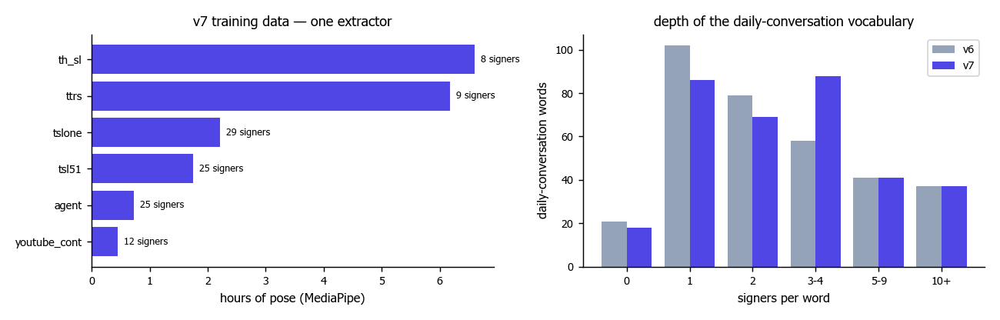
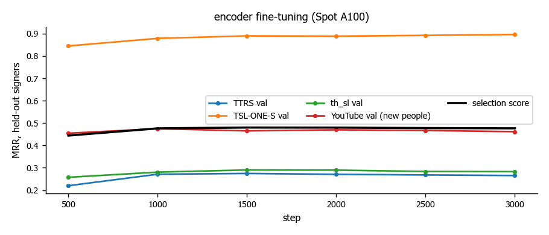
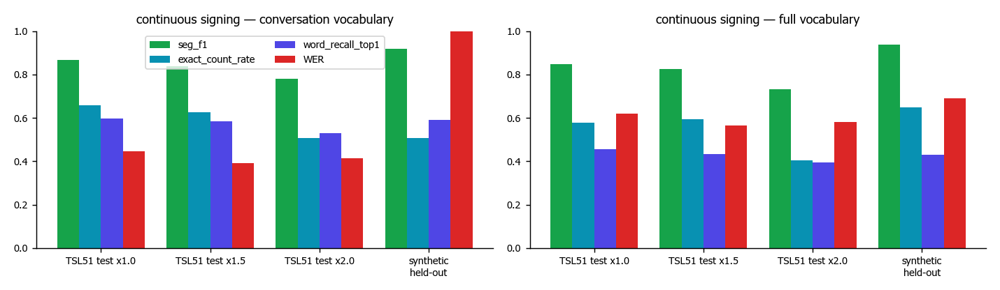
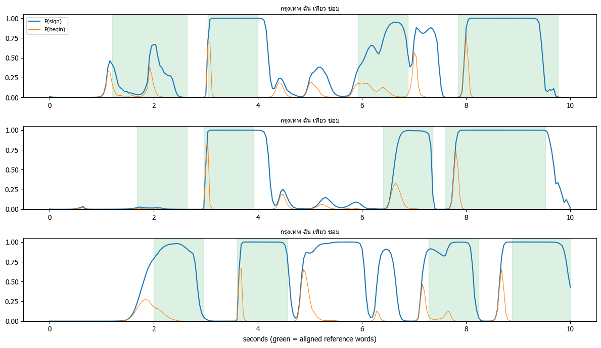
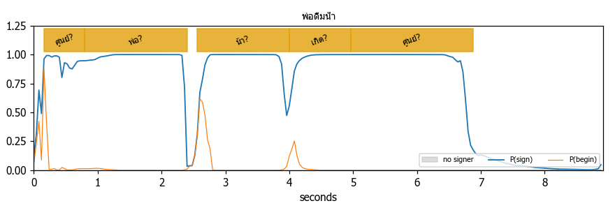

# ThaiSLM — Result Report v7

**Scope:** v7 = one extractor everywhere (MediaPipe Holistic, the same model file in Python and in the browser), 577 new
de-duplicated word clips from 25 new people, a daily-conversation vocabulary (322 concepts), one-pass spotting, a tagger trained
on all tune templates, a face channel, and a production web service (`docker compose up --build`). Every change was measured on
held-out data; data_test was **only reported, never used for a decision**. Architecture: `architecture_v7.md`. Representation
space: `latent_space_v7.md`. File map: `file_structure.pdf`. Lab: `lab.ipynb` (executes with 0 errors).

---

## 0. TL;DR

| question | answer |
|---|---|
| Better than v6 on continuous signing (held-out TSL51 test templates, conversation vocabulary)? | **Yes, clearly.** WER **0.446** (v6 0.571) · segment F1 **0.866** (v6 0.793) · 2× speed WER **0.415** (v6 0.558). Full 9.9k vocabulary: WER 0.618. |
| Better on held-out signers (isolated signs, same queries and same bank)? | **Yes on every dictionary test set:** TTRS 0.167 → **0.202**, th_sl 0.091 → **0.122**, TSL-ONE-S 0.845 → **0.857**, new YouTube people 0.310 → **0.352**, TSL51 researcher 0.275 → **0.389** (v6 lost to zero-shot here; v7 recovers it). |
| Better on real-world video (data_test, from the raw videos)? | **Partly.** Reference word in some segment's top-5: **16/22** (v6 14/22); top-1 **9/22** (same as v6). Every accepted word was right (**4/4**), but most sentences are withheld (shown as "[?] ≈ nearest", not spoken). **data_test does not all pass** (§6). |
| Real-time, end to end from a webcam? | **Yes.** The browser runs MediaPipe on the device; the server does the rest in **0.3–0.8 s** for 2.4–10 s of signing (CPU, ONNX Runtime, no PyTorch). Tested through the Next.js UI: a held-out-signer video gave "ฉันกินขนมปัง" in 2.8 s, every word accepted, spoken by the TTS service. |
| Self-made TSL-grammar sentences (held-out signers, from the pixels)? | 32 videos (16 sentences × 2 speeds): word R@1 **0.59**, R@5 **0.85**, accepted words **12/12 correct**, count error 0.28 words per sentence. |
| Natural fast signing by an unseen person (real YouTube phrases)? | **Weak:** R@1 **0.07** on the test half. Three signs in 1.5 s become one segment, and most phrase words have 1–2 training signers. This is the main open problem (§7). |
| ASL/CSL prior bias (P5)? | Error rate fell (0.486 → **0.440**), but errors the zero-shot model already made did **not** fall (0.167 → 0.171 per query). Not solved; documented in `latent_space_v7.md`. |
| ไหม (P6)? | It is in **no** source. 4 cuts from question-phrase videos agreed in the embedding but showed different handshapes when checked by eye, so they were **rejected**. The face cue (brow raise) was then validated on 7 real yes/no questions and fired on **0/7**, so questions are **not** inferred from the face. Negation (head shake) stays. |
| Cost | **One GPU job**: Spot A100, 41 min, ≈ **$1.06** list Spot price (expect ≤ $2.5 billed). Everything else ran locally. After the round the bucket was emptied (kept), all 3 Vertex jobs were deleted, and no VM, disk, IP or endpoint exists. |

---

## 1. What changed from v6, and why (prompt_9 gaps)

| v6 gap (prompt_9) | v7 action | result |
|---|---|---|
| P1 tagger trained on ¾ of the tune templates, epoch picked on real templates | final tagger on **all** tune templates; epoch picked on a **synthetic held-out** set; 2 out-of-fold taggers keep decoder tuning honest | boundary F1 on TSL51 test sentences 0.20 → **0.247**; count error 0.52 → **0.37** |
| P2 extra segments at hand transitions; hub words (เด็ก, ศูนย์) | real transition clips as a "not a sign" class; post-filter (short / low-P(sign) segments, repeats); hard-negative batches | segment F1 0.793 → **0.866**; เด็ก no longer appears on data_test. ศูนย์ / เกิด still appear on พ่อดื่มน้ำ |
| P3/P4 bank depth; a real test set | YouTube word-lesson harvest, de-duplicated (YouTube ID, sha256, **visual copy check**), signers identified by face, roles by person | +577 clips / 472 concepts / 25 people; concepts with ≥ 3 signers 567 → **696**; new **AGENT_test** = 86 clips of people never seen in training |
| P5 RTMW ↔ MediaPipe gap | **one extractor** for all video, identical in the browser; RTMW views kept only as extra training positives; webcam augmentation | same clip MediaPipe vs RTMW cosine 0.815 → 0.848; no extractor mismatch is left at inference |
| P5 ASL/CSL prior | hard negatives from CosFace neighbours, Thai daily-word oversampling | error rate down, inherited errors unchanged (§4) |
| P6 ไหม | searched every source + question-phrase cuts + face cue | not found / rejected / not reliable (§0) |
| production | ONNX Runtime + NumPy runtime; one-pass spotting (one encoder pass per utterance); web service | 10 s of signing → 0.77 s on a laptop CPU |

## 2. Data



| | v6 | v7 |
|---|---|---|
| extractor | RTMW (server) + MediaPipe (some sources) | **MediaPipe Holistic for all video**, the same file the browser runs |
| primary clips · hours of pose | 19,211 · 26.7 h (mixed) | **19,347 · 17.9 h MediaPipe** (+ 13,573 RTMW views of the same videos used only as training positives) |
| concepts | 9,869 | **9,922** |
| concepts with ≥ 2 / ≥ 3 signers | 1,969 / 567 | **2,074 / 696** |
| daily words with ≥ 3 signers | – | **166 / 339** |
| signers | 151 ids | 96 people-level ids (channels merged by face) |

**Harvest (`cloud_s3/agent_data/youtube_words/`).** Searched YouTube for single-word TSL lessons of the daily words. We also
crawled the channels found. 577 clips were accepted: 472 concepts, 25 people across 33 channels; train 401, val 90, test 86.
Every clip carries its word, concept, span, signer, role and an accept/reject reason in `items.csv`.

Duplicate control, as asked:

| check | removed |
|---|---|
| YouTube ID against the v4 corpus | 1 |
| sha256 of the file | 0 |
| **visual copy check** (16×16 look + 32×32 motion at the best time offset; calibrated so a re-upload scores 0.044 / 0.91 and the same person repeating a sign 0.04–0.06 / 1.08–1.19) | 2 re-uploads |
| data_test look-alike (face + thumbnail, then checked by eye) | 0 |
| held-out corpus signers appearing in the harvest | 0 |

The signer of the phrase videos is forced into the test role, so the phrase results are on an unseen person.

**Foreign signs:** none were added. `vocab/missing_word_strategy.json` covers the 18 daily words with no Thai data. Each one has
a Thai synonym, a composition of other signs, a face cue or fingerspelling.

## 3. Training (one GPU job)

| stage | where | what |
|---|---|---|
| encoder | Vertex AI, Spot A100, europe-west4 (won the 3-region race; the other two were cancelled while still pending, $0) | 3,000 steps, eval every 500; CosFace + SupCon, hard negatives re-mined at each eval, cross-extractor positives, webcam augmentation, EMA 0.998; best step 1,500 (val 0.480) |
| span head, taggers, alignment | local GPU (`python main.py train-seq`) | distillation of the isolated-window encoder into the span head; final tagger plus 2 fold taggers |
| decoder, calibration, grammar | local | chosen on TSL51 tune templates (fold taggers) |



## 4. Isolated signs, held-out signers (`artifacts/reports/isolated.json`)

Same MediaPipe queries and the same train-only bank (9.9k concepts) for every encoder:

| protocol | n | zero-shot | v6 encoder | **v7** |
|---|---|---|---|---|
| TTRS test signers | 84 | 0.131 | 0.167 | **0.202** |
| th_sl unseen signer | 286 | 0.073 | 0.091 | **0.122** |
| TSL-ONE-S 5 unseen signers | 873 | 0.784 | 0.845 | **0.857** |
| YouTube new people (AGENT_test) | 71 | 0.310 | 0.310 | **0.352** |
| TSL51 researcher (video) | 524 | **0.397** | 0.275 | 0.389 |
| … daily words, conversation vocabulary: AGENT / TSL51 | 36 / 524 | 0.528 / 0.698 | 0.583 / 0.582 | **0.611** / 0.683 |


Recall by bank depth: 0.15 (1 signer) · 0.18 (2) · 0.37 (3–4) · 0.41 (5–9) · **0.84 (10+)**. Signers per word is still the
strongest lever.

Still weak, as measured:
- **Null vs sign** on the TSL51 researcher fell from 0.82 (zero-shot) to 0.71. Only 23 null clips are behind this number, and
  continuous spotting uses the tagger to reject non-signs, not this score.
- **Prior bias.** 39 % of v7's remaining errors are confusions the zero-shot model also made (v6 34 %). Absolute inherited errors
  per query stayed at 0.17.

## 5. Continuous signing (held-out TSL51 test templates; `artifacts/reports/spotting.json`)



| test set (conversation vocabulary) | seg F1 | exact count | recall@1 | recall@5 | prec@1 | WER | v6 WER |
|---|---|---|---|---|---|---|---|
| 1× | **0.866** | 0.659 | 0.598 | 0.811 | 0.556 | **0.446** | 0.571 |
| 1.5× | 0.838 | 0.627 | 0.584 | 0.749 | 0.631 | **0.391** | 0.570 |
| 2× | 0.779 | 0.508 | 0.531 | 0.682 | 0.613 | **0.415** | 0.558 |
| full vocabulary, 1× | 0.848 | 0.579 | 0.456 | 0.591 | 0.434 | 0.618 | – |

The test templates were never used for any choice. Decisions were made on the tune templates using the out-of-fold taggers:
- One-pass span head instead of one encoder pass per window. Recall@1 is 0.598 vs 0.58 for the slow per-window teacher, so it is
  just as accurate with one encoder pass per utterance instead of one per window (≈ 420 windows for a 9 s clip).
- No exact re-score for the conversation vocabulary.
- Stride 4, λ 6, min length 14 frames, tempo reference 16.
- Grammar re-rank weight 0.5 (tune WER 0.643 → 0.611).



**Natural-signing tuning, tried and rejected.** Half of the real phrase clips (`natural_tuning.json`) were used to re-choose
min length, stride, λ, begin bonus and tempo, under the rule that TSL51 tune may not drop by more than 0.02. The best allowed
setting improved the phrase score by only 0.002, inside noise, so the TSL51-tuned decoder was kept.

## 6. Real-world: data_test (from the raw videos; `artifacts/reports/infer_final.json`, `result_reporting/inference/`)

| | v5 | v6 | **v7** |
|---|---|---|---|
| reference word = top-1 of some segment | 7/22 | 9/22 | 9/22 (full vocabulary 10/22) |
| reference word in some segment's top-5 | 10/22 | 14/22 | **16/22** |
| accepted words correct | 6/12 | 7/7 | **4/4** |

| video | reference | top-1 per segment | sentence (spoken only if confirmed) |
|---|---|---|---|
| test1 | สวัสดี สบายดี ชอบ โกรธ แมว แฟน ปรบมือ | **สวัสดี · สบายดี** · ฉัน · **ชอบ** · หก · **แมว** · นั่ง · แมว | "สวัสดี สบายดี ฉันชอบแมวนั่ง" |
| ฉันปลอบเพื่อนร้องไห้ | ฉัน ปลอบใจ เพื่อน ร้องไห้ | **เพื่อน** · ดู · ข้าว · เกิด | "เพื่อนดู [?] [?]" |
| ฉันรักเพื่อน | ฉัน รัก เพื่อน | **ฉัน** · เกิด | withheld |
| พ่อดื่มน้ำ | พ่อ ดื่ม น้ำ | ศูนย์ · **พ่อ** · น้า · เกิด · ศูนย์ | withheld (ดื่ม, น้ำ in top-5) |
| ไปทานข้าวด้วยกันมั้ย | ไป กิน ข้าว ด้วยกัน ไหม | คุณ · ฉัน · **ข้าว** · **ไป** | withheld |



**Why data_test does not all pass:**
- The videos are fast phone signing by people who are in no source.
- รัก / ปลอบใจ / แฟน / ปรบมือ have 1–2 training signers.
- ไหม is in no data.
- In พ่อดื่มน้ำ, a long hold is cut into extra segments (ศูนย์ / เกิด).

The system's answer to this is to **not guess**. Uncertain words are shown as "word?" or "[?] ≈ nearest", and a sentence is only
spoken when its evidence is accepted. Getting data_test to all pass would need more signers per daily word and natural-pace
sentence data, not more tuning (tuning on data_test would only hide the problem).

## 7. Self-made sentences, real phrases, face channel

**Self-made TSL-grammar sentences** (`selftest.json`, §7 of `lab.ipynb`). 16 sentences in TSL word order (e.g. `พ่อ น้ำ ดื่ม`,
`วันนี้ ฉัน โรงเรียน ไป`) were built from the real clips of held-out signers, joined with hand transitions, and re-encoded to
H.264. Bank = training signers only.

| speed | R@1 | R@5 | accepted correct | count error |
|---|---|---|---|---|
| 1.3× | 0.61 | 0.86 | 5/5 | 0.38 |
| 1.8× | 0.57 | 0.84 | 7/7 | 0.19 |

**Real phrases by an unseen YouTube signer** (`phrases.json`, test half: 21 videos, 75 words). R@1 0.07, R@5 0.16, accepted 1/6
correct, segment count off by 1.8 per phrase (mostly too few segments). Natural conversation is much faster and more co-articulated than any training data. This
is the honest limit of v7 for "daily conversation in real time".

**Face channel** (`nmm_validation.json`). Emotion thresholds were calibrated on 580 neutral dictionary faces (97th percentile per
emotion). On 54 labelled phrases, the yes/no brow cue fired on 0/7 yes/no questions and the wh-cue on 14 % of wh-questions. So the
face is used for **negation** (head shake) and for the **emotion of the voice** only, not to turn a sentence into a question.

## 8. Production

| item | result |
|---|---|
| runtime | ONNX Runtime + NumPy (`modules/runtime.py`), no PyTorch in the service image |
| int8 encoder | **rejected**: 0.956 top-1 agreement but tagger P(sign) differs by up to 0.70 → fp32 kept (parity cos 1.000; `models/onnx/parity.json`) |
| latency after landmarks (CPU) | 2.4 s → 275 ms · 5 s → 437 ms · 10 s → 774 ms; LLM sentence 1–2 s (rules composer: < 5 ms) |
| browser | MediaPipe tasks-vision 1.0.1 runs on the device, so only landmarks are uploaded |
| service | `docker compose up --build`: gateway (nginx :8080) · web (Next.js 16) · sign-api (FastAPI) · tts (MMS-TTS Thai). `--scale sign-api=N` for more replicas |
| tested | camera → live mode (hands-down endpointing) → text + speech; upload in browser or on server; API `/v1/translate`, `/v1/translate/video`, `/v1/speak` |

## 8b. v7.1 — fixes after real camera tests

| problem seen by the user | cause found | fix | verified |
|---|---|---|---|
| camera on, but no landmarks at all | the GPU face-expression model loads, then fails on every frame ("No support of const"); the app fell back to CPU only on a *load* error, so the first frame stopped the camera loop | one test frame decides GPU / GPU+CPU (expressions on the CPU every 5th frame) / CPU; a failing frame never stops the loop | fake-webcam test: GPU+CPU chosen automatically, body / face / hands detected |
| live mode: "สั้นเกินไป — ทำท่าอย่างน้อย ~0.5 วินาที" | a frame-count rule (10 frames) — 0 frames when the loop had stopped, few at low fps; short hand raises raised an error | time-based minimum (0.6 s = the model's shortest sign); live mode skips short raises quietly; manual mode states the recorded length | 0.3 s recording → exact message; live sentences processed |
| a word-by-word sentence split into single words | 0.9 s hands-down ended the utterance | 1.5 s default, adjustable 0.9 / 1.5 / 2.5 s | "ฉัน ขนมปัง กิน" → one card "ฉันกินขนมปัง" 3/3 times (it was split before) |
| "วันนี้ กิน ข้าว ยัง" → "วันนี้ ยัง ข้าว" | the LLM dropped a word; the guard only checked the word list | the sentence itself must contain every chosen word, add no person, and not leave TSL order unchanged — else the rules composer (Thai order: time → subject → verb → object/place → question) | user's examples all correct with and without the LLM |
| no progress while processing | – | streaming API (`/stream`, NDJSON) + progress bar of the real stages | stages arrive live through the gateway |
| face hidden by dots; no live emotion | – | thin face contours, face box with live emotion, labelled hand boxes | – |
| different cameras / lighting | – | automatic gamma + contrast normalisation (browser and server, same rule) | hand detection +0.04 to +0.08 in dark / bright / low-contrast video, unchanged on good video |

**ไหม as a facial expression (user's knowledge: brows drawn together).** Measured before using it: an absolute furrow fired on 52 %
of statements vs 25 % of yes/no questions of the unseen YouTube signer; furrow relative to the signer's resting face fired on 0/8
yes/no questions and 1/25 statements (this signer's brows *relax* in questions). In data_test the real question
ไปทานข้าวด้วยกันมั้ย shows no furrow, the statement ฉันรักเพื่อน a strong one. So it is not switched on automatically; it is an
experimental option that compares with *your* resting face, and the result card says when it fired.

## 9. Cost and clean-up

| item | ≈ USD |
|---|---|
| encoder, Spot A100 (a2-highgpu-1g), 41.0 min run (9.3 min queued, not billed) | 1.06 (list Spot); v6 was billed ≈ 2.5× its estimate → **≤ 2.5** |
| the two cancelled racers (still pending when cancelled) | 0 |
| OpenAI gpt-4.1-mini (sentence layer, evaluations) | < 0.5 |
| GCS storage (hours) | < 0.1 |
| **total** | **≈ 1.6 – 3**, inside the $5–6 limit |

Everything else ran locally for free: MediaPipe re-extraction of all video (CPU), harvest, identity, span head and taggers,
tuning, evaluation, ONNX export, Docker tests.

**Clean-up done** (`python main.py cloud cleanup`):
- `gs://temp-gpu-bucket-job` emptied (0 objects, soft-delete retention 0) and the bucket kept.
- All 3 Vertex AI custom jobs deleted.
- No Compute Engine instance, disk, address, snapshot or image; no Vertex endpoint or model; no other bucket.

**S3 (not pushed by the agent).** To publish the new data, run:

```bash
aws s3 sync cloud_s3/agent_data s3://dsi490-lake-signdata/agent_data --profile <your-sso-profile>
aws s3 sync cloud_s3/data_prep s3://dsi490-lake-signdata/data_prep --profile <your-sso-profile>
```

## 10. Reproduce

```bash
python main.py extract                                   # MediaPipe on every source video (CPU, resumable)
python main.py harvest discover && python main.py harvest candidates && python main.py harvest download
python main.py harvest videos && python main.py harvest signers && python main.py harvest label
python main.py prep shards
python main.py cloud upload-code --tag v7 && python main.py cloud upload-data && python main.py cloud upload-models
python main.py cloud launch --tag v7 --stage train_encoder --hours 1.2 --args "--steps 3000 --eval_every 500"
python main.py train-seq --encoder_run artifacts/runs/enc-v7-europe-west4
python main.py eval build --run enc-v7-europe-west4 --seq seq-v7 && python main.py eval grammar && python main.py eval spot --seq seq-v7
python main.py eval isolated --run enc-v7-europe-west4 --v6 && python main.py eval selftest --make && python main.py eval phrases
python main.py export-onnx && python main.py test && python scripts/make_lab.py --execute
python main.py cloud cleanup
```

Runs used: encoder `enc-v7-europe-west4`, sequence `seq-v7` (`models/config.json`).
